

  <h1>WALLPAPERS</h1>
  
A curated collection of wallpapers organized by category.

  

    
    
    
  

---

## Table of contents

- [Anime](#anime)
- [Catppuccin](#catppuccin)
- [Cyberpunk](#cyberpunk)
- [Dracula](#dracula)
- [Everforest](#everforest)
- [Gruvbox](#gruvbox)
- [Landscape](#landscape)
- [Low-Quality](#low-quality)
- [Minecraft](#minecraft)
- [Minimalist](#minimalist)
- [Monochrome](#monochrome)
- [Neon](#neon)
- [Nord](#nord)
- [NSFW](#nsfw)
- [Phone](#phone)
- [Pixel Art](#pixel-art)
- [Space](#space)
- [Tokyonight](#tokyonight)

---

  <h2>Anime</h2>
  

    
  

  <marquee behavior="scroll" direction="left" scrollamount="4">
    
    
    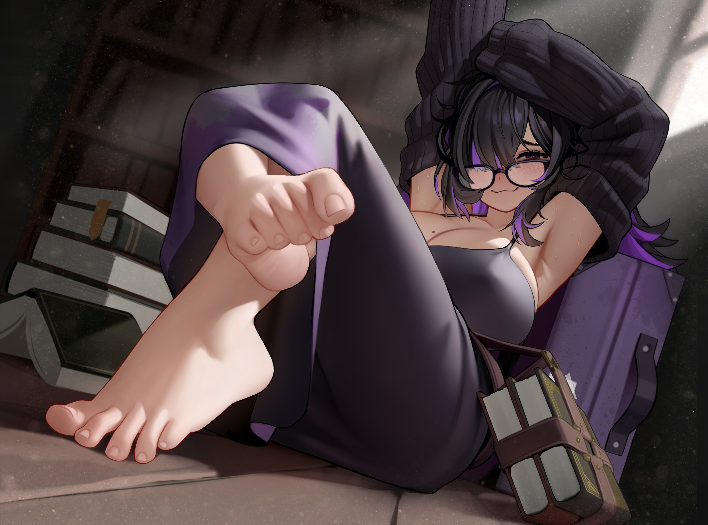
    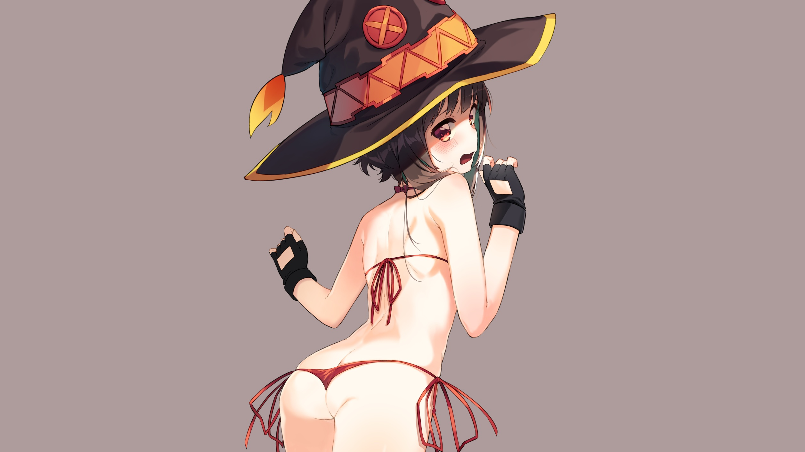
    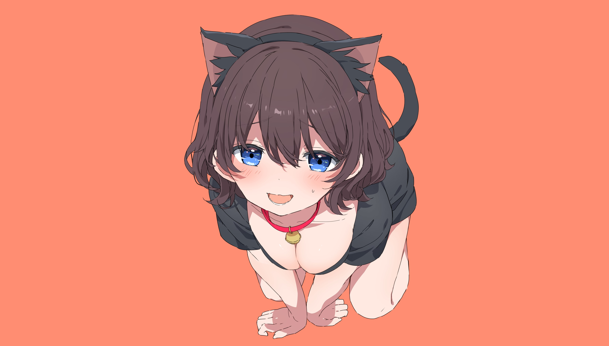
    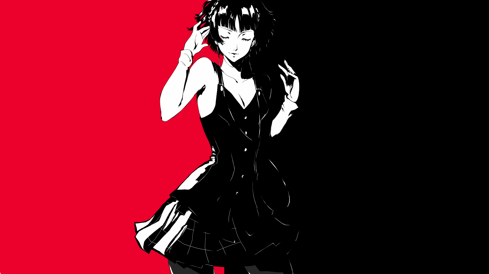
    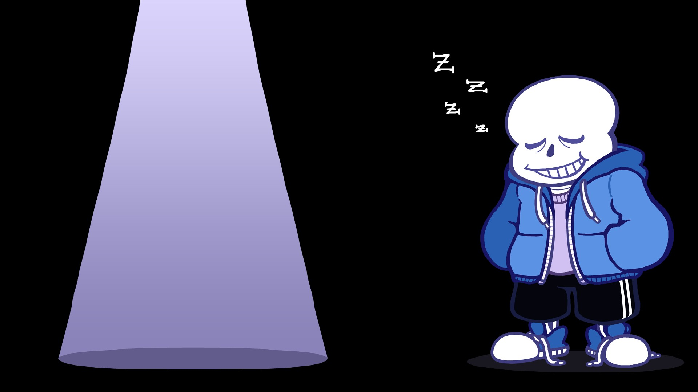
  </marquee>

---

  <h2>Catppuccin</h2>
  

    
  

  <marquee behavior="scroll" direction="left" scrollamount="4">
    
    
    
    
    
    
  </marquee>

---

  <h2>Cyberpunk</h2>
  

    
  

  <marquee behavior="scroll" direction="left" scrollamount="4">
    
    
    
    
    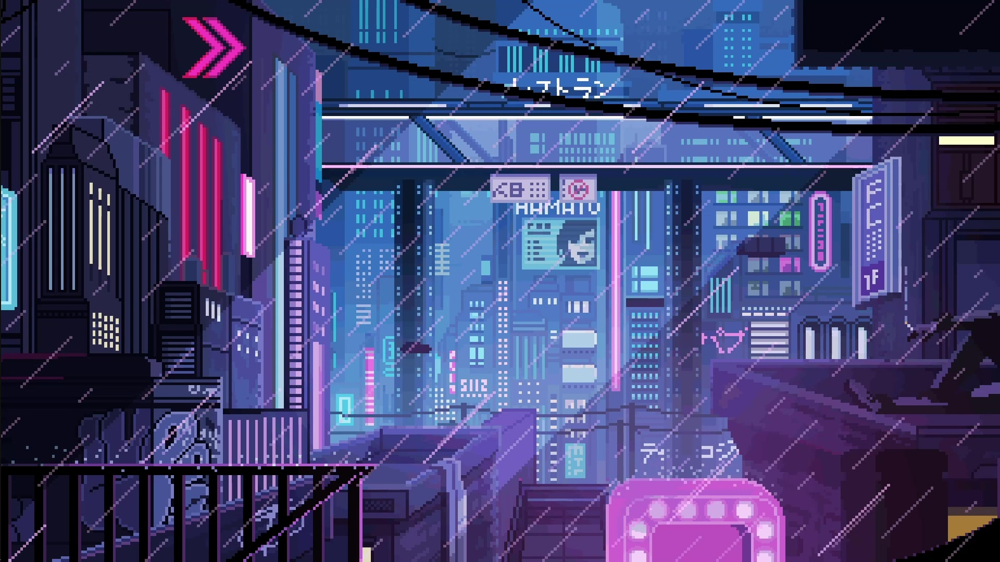
    
  </marquee>

---

  <h2>Dracula</h2>
  

    
  

  <marquee behavior="scroll" direction="left" scrollamount="4">
    
    
    
    
    
  </marquee>

---

  <h2>Everforest</h2>
  

    
  

  <marquee behavior="scroll" direction="left" scrollamount="4">
    
    
    
    
    
  </marquee>

---

  <h2>Gruvbox</h2>
  

    
  

  <marquee behavior="scroll" direction="left" scrollamount="4">
    
    
    
    
    
  </marquee>

---

  <h2>Landscape</h2>
  

    
  

  <marquee behavior="scroll" direction="left" scrollamount="4">
    
    
    
    
    
    
  </marquee>

---

  <h2>Low-Quality</h2>
  

    
  

  <marquee behavior="scroll" direction="left" scrollamount="4">
    
    
    
    
    
  </marquee>

---

  <h2>Minecraft</h2>
  

    
  

  <marquee behavior="scroll" direction="left" scrollamount="4">
    
    
    
    
    
  </marquee>

---

  <h2>Minimalist</h2>
  

    
  

  <marquee behavior="scroll" direction="left" scrollamount="4">
    
    
    
    
    
  </marquee>

---

  <h2>Monochrome</h2>
  

    
  

  <marquee behavior="scroll" direction="left" scrollamount="4">
    
    
    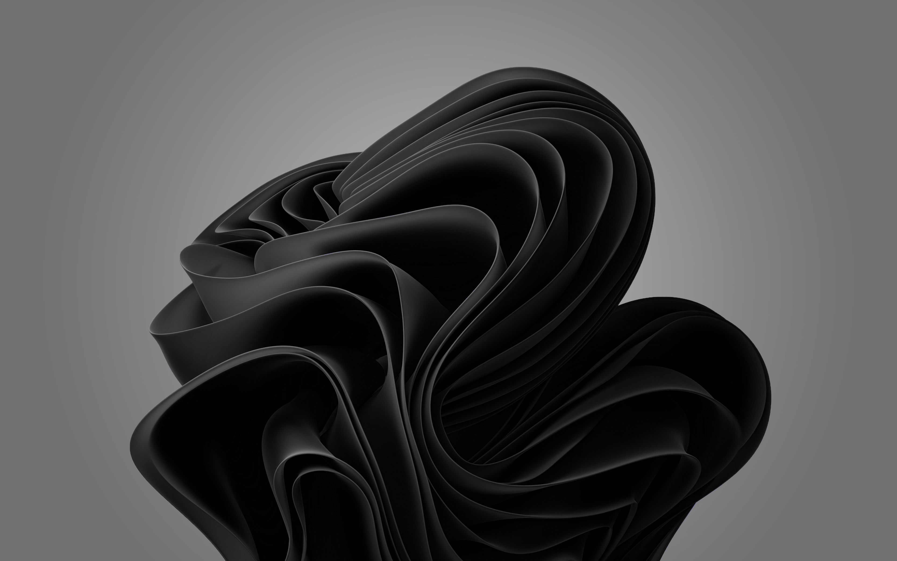
    
    
  </marquee>

---

  <h2>Neon</h2>
  

    
  

  <marquee behavior="scroll" direction="left" scrollamount="4">
    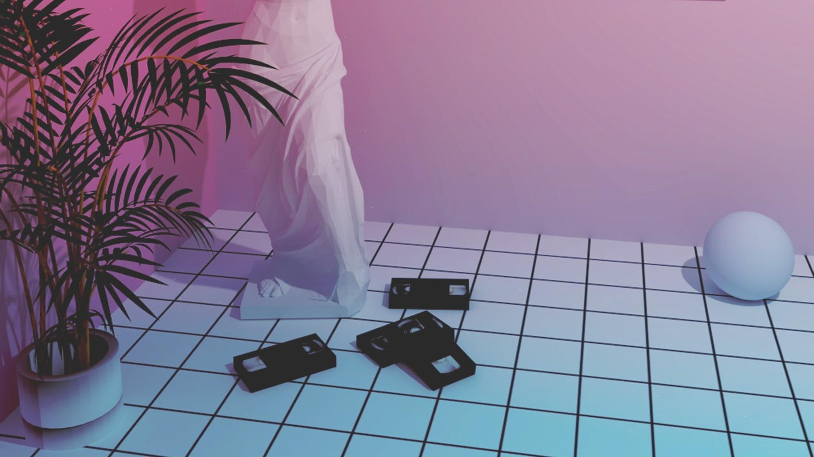
    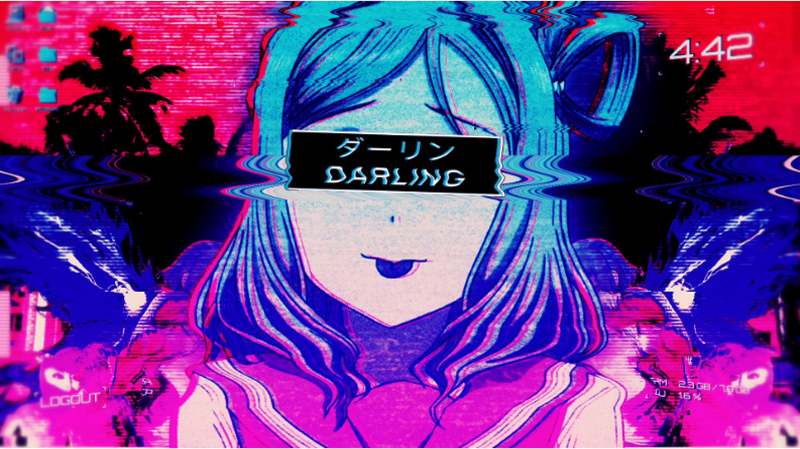
    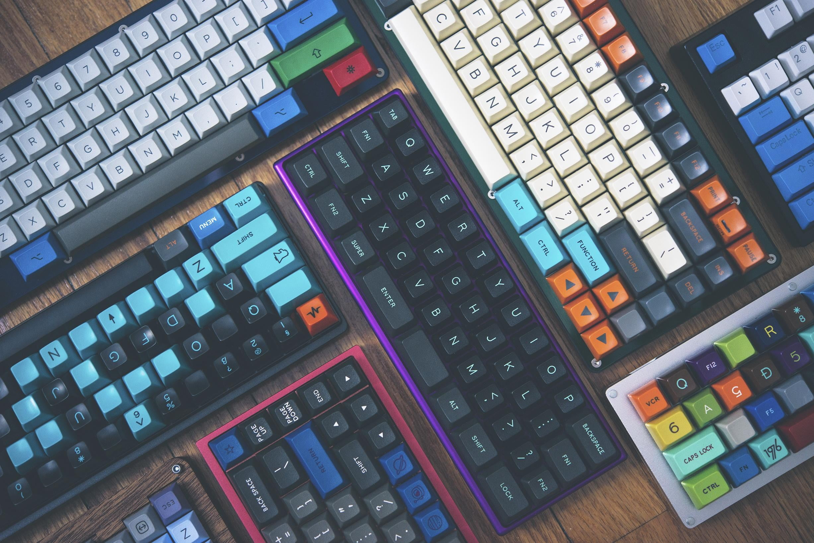
    
    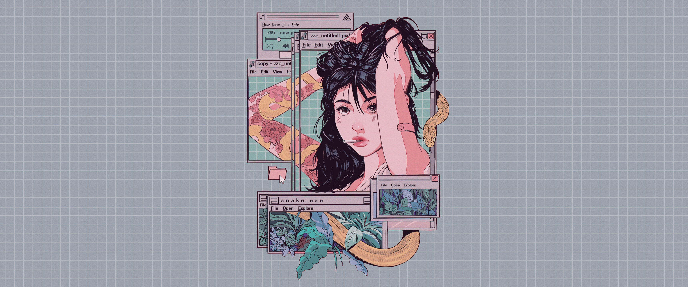
  </marquee>

---

  <h2>Nord</h2>
  

    
  

  <marquee behavior="scroll" direction="left" scrollamount="4">
    
    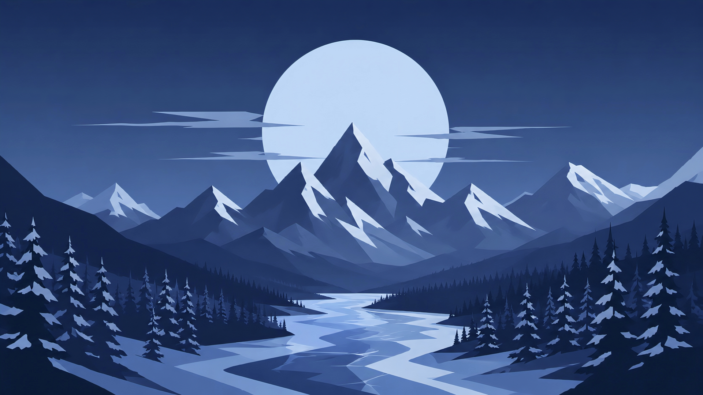
    
    
    
  </marquee>

---

  <h2>NSFW</h2>
  

    
  

  
<strong>Adult content.</strong> Browse the <code>NSFW/</code> folder directly.

  <marquee behavior="scroll" direction="left" scrollamount="4">
    
    
    
    
    
    
  </marquee>

---

  <h2>Phone</h2>
  

    
  

  <marquee behavior="scroll" direction="left" scrollamount="4">
    
    
    
    
    
  </marquee>

---

  <h2>Pixel Art</h2>
  

    
  

  <marquee behavior="scroll" direction="left" scrollamount="4">
    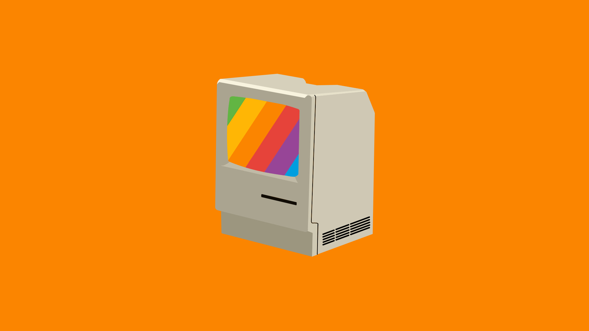
    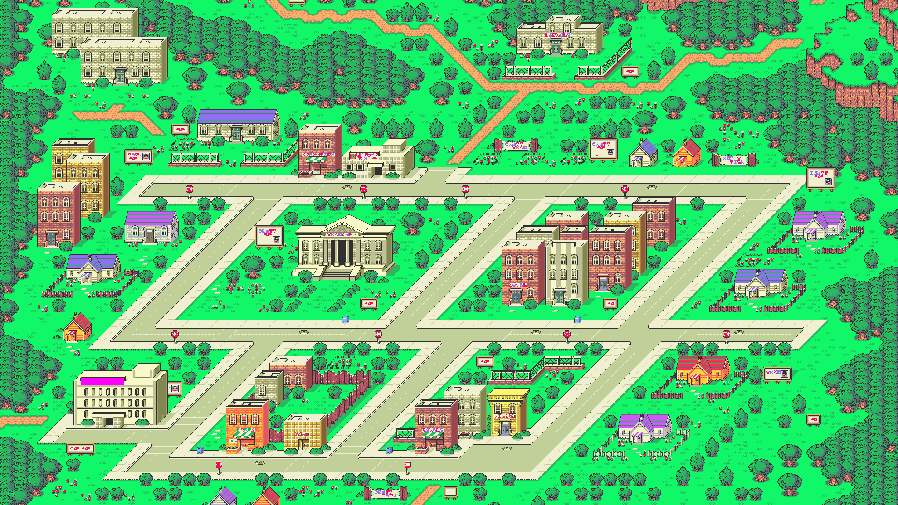
    
    
    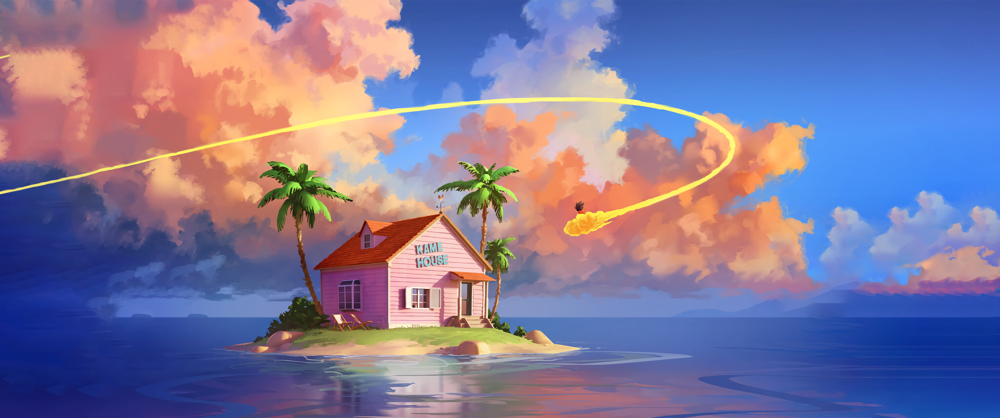
  </marquee>

---

  <h2>Space</h2>
  

    
  

  <marquee behavior="scroll" direction="left" scrollamount="4">
    
    
    
    
    
  </marquee>

---

  <h2>Tokyonight</h2>
  

    
  

  <marquee behavior="scroll" direction="left" scrollamount="4">
    
    
    
    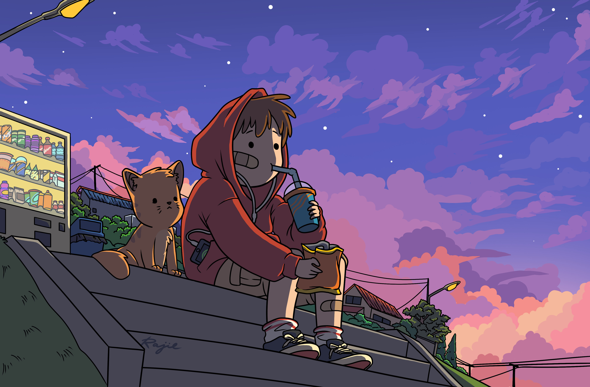
    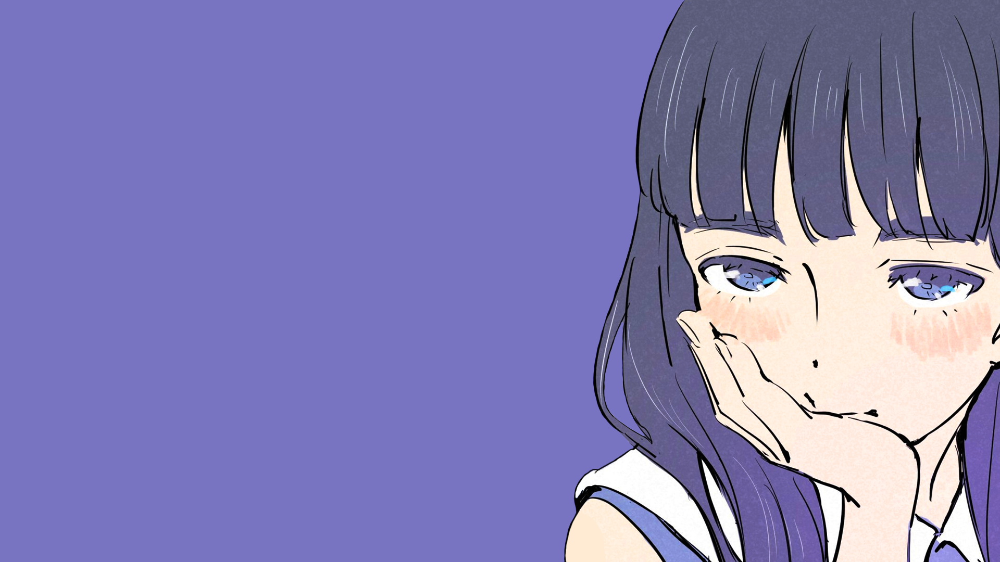
  </marquee>

---

## File formats

The collection includes static and animated media:

| Format | Description |
|--------|-------------|
| JPG / JPEG | Photography and illustrations |
| PNG | Flat colors and transparent artwork |
| WEBP | High-performance images |
| GIF | Looping animated wallpapers |
| MP4 / WEBM | Short videos for animated backgrounds |

## How to use

1. Open the category you like.
2. Pick the image you want.
3. Download it or copy its raw URL to use it as your desktop or phone wallpaper.

## Contributing

Suggestions and contributions are welcome. If you want to add a new wallpaper, place it in the right category and follow the existing naming style.
