

  <h1>WALLPAPERS</h1>
  
A curated collection of wallpapers organized by category.

  

    
    
  

---

## Organized with <a href="https://github.com/leriart/Wanalizer">Wanalizer</a>

This collection is organized thanks to <strong>Wanalizer</strong>, an intelligent local wallpaper analyzer and categorizer.

---

## Table of contents

- [Anime](#anime)
- [Catppuccin](#catppuccin)
- [Cyberpunk](#cyberpunk)
- [Dracula](#dracula)
- [Everforest](#everforest)
- [Gruvbox](#gruvbox)
- [Landscape](#landscape)
- [Low-Quality](#low-quality)
- [Minecraft](#minecraft)
- [Minimalist](#minimalist)
- [Monochrome](#monochrome)
- [NSFW](#nsfw)
- [Neon](#neon)
- [Nord](#nord)
- [Phone](#phone)
- [Pixel-Art](#pixel-art)
- [Space](#space)
- [Tokyonight](#tokyonight)

---

  <h2>Anime</h2>
  

    
  

  

    <input class="r-anime" type="radio" name="s-anime" id="r-anime-0" checked>
    <input class="r-anime" type="radio" name="s-anime" id="r-anime-1">
    <input class="r-anime" type="radio" name="s-anime" id="r-anime-2">
    <input class="r-anime" type="radio" name="s-anime" id="r-anime-3">
    <input class="r-anime" type="radio" name="s-anime" id="r-anime-4">
    

      
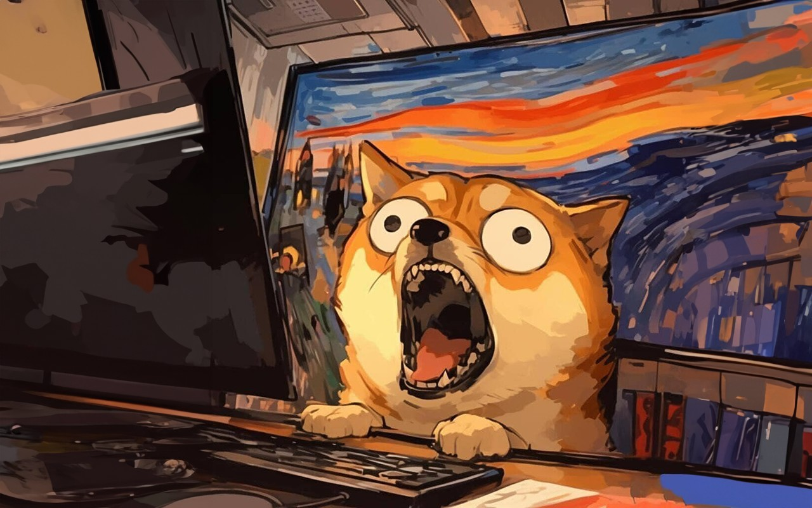

      

      
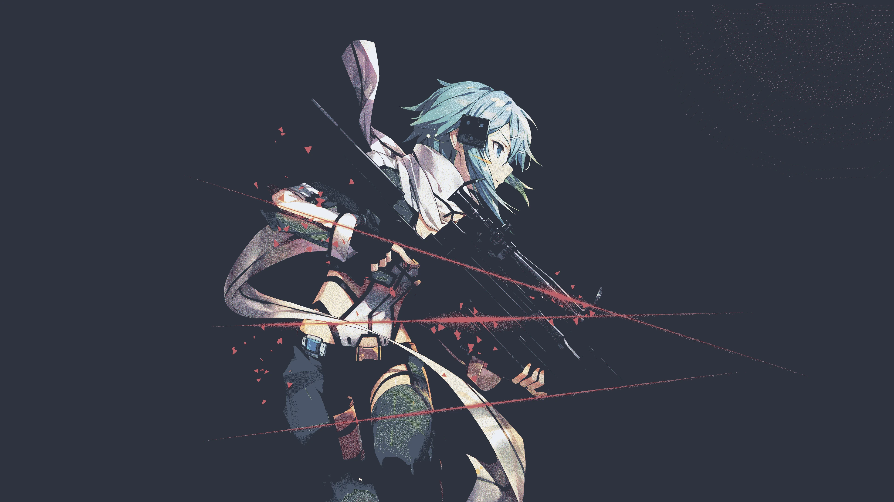

      

      
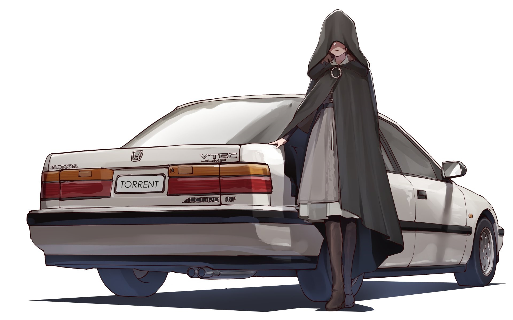

    

    <label class="ap-anime-0" for="r-anime-4" style="position:absolute;left:6px;top:50%;transform:translateY(-50%);width:32px;height:32px;background:rgba(13,17,23,0.75);border-radius:50%;align-items:center;justify-content:center;color:#c0caf5;font-size:18px;cursor:pointer;user-select:none;text-decoration:none;">&#9664;</label>
    <label class="ap-anime-1" for="r-anime-0" style="position:absolute;left:6px;top:50%;transform:translateY(-50%);width:32px;height:32px;background:rgba(13,17,23,0.75);border-radius:50%;align-items:center;justify-content:center;color:#c0caf5;font-size:18px;cursor:pointer;user-select:none;text-decoration:none;">&#9664;</label>
    <label class="ap-anime-2" for="r-anime-1" style="position:absolute;left:6px;top:50%;transform:translateY(-50%);width:32px;height:32px;background:rgba(13,17,23,0.75);border-radius:50%;align-items:center;justify-content:center;color:#c0caf5;font-size:18px;cursor:pointer;user-select:none;text-decoration:none;">&#9664;</label>
    <label class="ap-anime-3" for="r-anime-2" style="position:absolute;left:6px;top:50%;transform:translateY(-50%);width:32px;height:32px;background:rgba(13,17,23,0.75);border-radius:50%;align-items:center;justify-content:center;color:#c0caf5;font-size:18px;cursor:pointer;user-select:none;text-decoration:none;">&#9664;</label>
    <label class="ap-anime-4" for="r-anime-3" style="position:absolute;left:6px;top:50%;transform:translateY(-50%);width:32px;height:32px;background:rgba(13,17,23,0.75);border-radius:50%;align-items:center;justify-content:center;color:#c0caf5;font-size:18px;cursor:pointer;user-select:none;text-decoration:none;">&#9664;</label>
    <label class="an-anime-0" for="r-anime-1" style="position:absolute;right:6px;top:50%;transform:translateY(-50%);width:32px;height:32px;background:rgba(13,17,23,0.75);border-radius:50%;align-items:center;justify-content:center;color:#c0caf5;font-size:18px;cursor:pointer;user-select:none;text-decoration:none;">&#9654;</label>
    <label class="an-anime-1" for="r-anime-2" style="position:absolute;right:6px;top:50%;transform:translateY(-50%);width:32px;height:32px;background:rgba(13,17,23,0.75);border-radius:50%;align-items:center;justify-content:center;color:#c0caf5;font-size:18px;cursor:pointer;user-select:none;text-decoration:none;">&#9654;</label>
    <label class="an-anime-2" for="r-anime-3" style="position:absolute;right:6px;top:50%;transform:translateY(-50%);width:32px;height:32px;background:rgba(13,17,23,0.75);border-radius:50%;align-items:center;justify-content:center;color:#c0caf5;font-size:18px;cursor:pointer;user-select:none;text-decoration:none;">&#9654;</label>
    <label class="an-anime-3" for="r-anime-4" style="position:absolute;right:6px;top:50%;transform:translateY(-50%);width:32px;height:32px;background:rgba(13,17,23,0.75);border-radius:50%;align-items:center;justify-content:center;color:#c0caf5;font-size:18px;cursor:pointer;user-select:none;text-decoration:none;">&#9654;</label>
    <label class="an-anime-4" for="r-anime-0" style="position:absolute;right:6px;top:50%;transform:translateY(-50%);width:32px;height:32px;background:rgba(13,17,23,0.75);border-radius:50%;align-items:center;justify-content:center;color:#c0caf5;font-size:18px;cursor:pointer;user-select:none;text-decoration:none;">&#9654;</label>
    

      <label for="r-anime-0" style="width:10px;height:10px;background:#7aa2f7;border-radius:50%;cursor:pointer;display:inline-block;"></label>
      <label for="r-anime-1" style="width:10px;height:10px;background:#30363d;border-radius:50%;cursor:pointer;display:inline-block;"></label>
      <label for="r-anime-2" style="width:10px;height:10px;background:#30363d;border-radius:50%;cursor:pointer;display:inline-block;"></label>
      <label for="r-anime-3" style="width:10px;height:10px;background:#30363d;border-radius:50%;cursor:pointer;display:inline-block;"></label>
      <label for="r-anime-4" style="width:10px;height:10px;background:#30363d;border-radius:50%;cursor:pointer;display:inline-block;"></label>
    

  

---

  <h2>Catppuccin</h2>
  

    
  

  

    <input class="r-catppuccin" type="radio" name="s-catppuccin" id="r-catppuccin-0" checked>
    <input class="r-catppuccin" type="radio" name="s-catppuccin" id="r-catppuccin-1">
    <input class="r-catppuccin" type="radio" name="s-catppuccin" id="r-catppuccin-2">
    <input class="r-catppuccin" type="radio" name="s-catppuccin" id="r-catppuccin-3">
    <input class="r-catppuccin" type="radio" name="s-catppuccin" id="r-catppuccin-4">
    

      

      

      

      
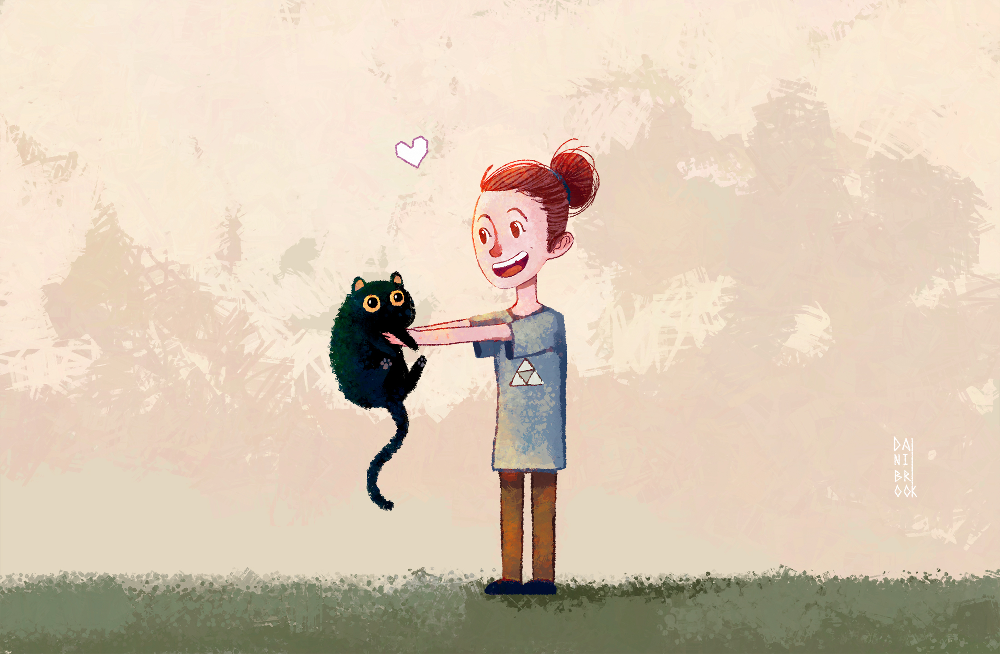

      

    

    <label class="ap-catppuccin-0" for="r-catppuccin-4" style="position:absolute;left:6px;top:50%;transform:translateY(-50%);width:32px;height:32px;background:rgba(13,17,23,0.75);border-radius:50%;align-items:center;justify-content:center;color:#c0caf5;font-size:18px;cursor:pointer;user-select:none;text-decoration:none;">&#9664;</label>
    <label class="ap-catppuccin-1" for="r-catppuccin-0" style="position:absolute;left:6px;top:50%;transform:translateY(-50%);width:32px;height:32px;background:rgba(13,17,23,0.75);border-radius:50%;align-items:center;justify-content:center;color:#c0caf5;font-size:18px;cursor:pointer;user-select:none;text-decoration:none;">&#9664;</label>
    <label class="ap-catppuccin-2" for="r-catppuccin-1" style="position:absolute;left:6px;top:50%;transform:translateY(-50%);width:32px;height:32px;background:rgba(13,17,23,0.75);border-radius:50%;align-items:center;justify-content:center;color:#c0caf5;font-size:18px;cursor:pointer;user-select:none;text-decoration:none;">&#9664;</label>
    <label class="ap-catppuccin-3" for="r-catppuccin-2" style="position:absolute;left:6px;top:50%;transform:translateY(-50%);width:32px;height:32px;background:rgba(13,17,23,0.75);border-radius:50%;align-items:center;justify-content:center;color:#c0caf5;font-size:18px;cursor:pointer;user-select:none;text-decoration:none;">&#9664;</label>
    <label class="ap-catppuccin-4" for="r-catppuccin-3" style="position:absolute;left:6px;top:50%;transform:translateY(-50%);width:32px;height:32px;background:rgba(13,17,23,0.75);border-radius:50%;align-items:center;justify-content:center;color:#c0caf5;font-size:18px;cursor:pointer;user-select:none;text-decoration:none;">&#9664;</label>
    <label class="an-catppuccin-0" for="r-catppuccin-1" style="position:absolute;right:6px;top:50%;transform:translateY(-50%);width:32px;height:32px;background:rgba(13,17,23,0.75);border-radius:50%;align-items:center;justify-content:center;color:#c0caf5;font-size:18px;cursor:pointer;user-select:none;text-decoration:none;">&#9654;</label>
    <label class="an-catppuccin-1" for="r-catppuccin-2" style="position:absolute;right:6px;top:50%;transform:translateY(-50%);width:32px;height:32px;background:rgba(13,17,23,0.75);border-radius:50%;align-items:center;justify-content:center;color:#c0caf5;font-size:18px;cursor:pointer;user-select:none;text-decoration:none;">&#9654;</label>
    <label class="an-catppuccin-2" for="r-catppuccin-3" style="position:absolute;right:6px;top:50%;transform:translateY(-50%);width:32px;height:32px;background:rgba(13,17,23,0.75);border-radius:50%;align-items:center;justify-content:center;color:#c0caf5;font-size:18px;cursor:pointer;user-select:none;text-decoration:none;">&#9654;</label>
    <label class="an-catppuccin-3" for="r-catppuccin-4" style="position:absolute;right:6px;top:50%;transform:translateY(-50%);width:32px;height:32px;background:rgba(13,17,23,0.75);border-radius:50%;align-items:center;justify-content:center;color:#c0caf5;font-size:18px;cursor:pointer;user-select:none;text-decoration:none;">&#9654;</label>
    <label class="an-catppuccin-4" for="r-catppuccin-0" style="position:absolute;right:6px;top:50%;transform:translateY(-50%);width:32px;height:32px;background:rgba(13,17,23,0.75);border-radius:50%;align-items:center;justify-content:center;color:#c0caf5;font-size:18px;cursor:pointer;user-select:none;text-decoration:none;">&#9654;</label>
    

      <label for="r-catppuccin-0" style="width:10px;height:10px;background:#7aa2f7;border-radius:50%;cursor:pointer;display:inline-block;"></label>
      <label for="r-catppuccin-1" style="width:10px;height:10px;background:#30363d;border-radius:50%;cursor:pointer;display:inline-block;"></label>
      <label for="r-catppuccin-2" style="width:10px;height:10px;background:#30363d;border-radius:50%;cursor:pointer;display:inline-block;"></label>
      <label for="r-catppuccin-3" style="width:10px;height:10px;background:#30363d;border-radius:50%;cursor:pointer;display:inline-block;"></label>
      <label for="r-catppuccin-4" style="width:10px;height:10px;background:#30363d;border-radius:50%;cursor:pointer;display:inline-block;"></label>
    

  

---

  <h2>Cyberpunk</h2>
  

    
  

  

    <input class="r-cyberpunk" type="radio" name="s-cyberpunk" id="r-cyberpunk-0" checked>
    <input class="r-cyberpunk" type="radio" name="s-cyberpunk" id="r-cyberpunk-1">
    <input class="r-cyberpunk" type="radio" name="s-cyberpunk" id="r-cyberpunk-2">
    <input class="r-cyberpunk" type="radio" name="s-cyberpunk" id="r-cyberpunk-3">
    <input class="r-cyberpunk" type="radio" name="s-cyberpunk" id="r-cyberpunk-4">
    

      
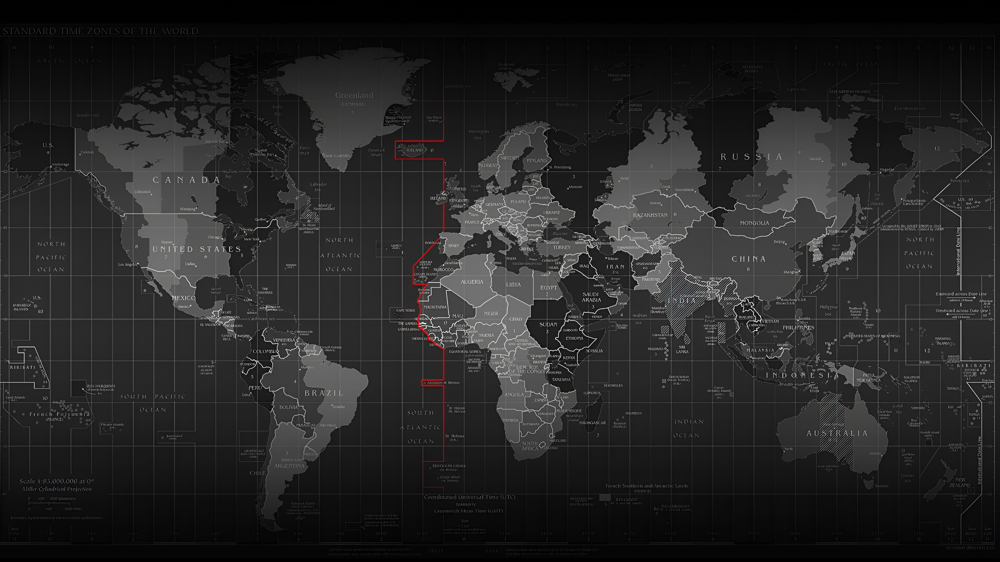

      

      
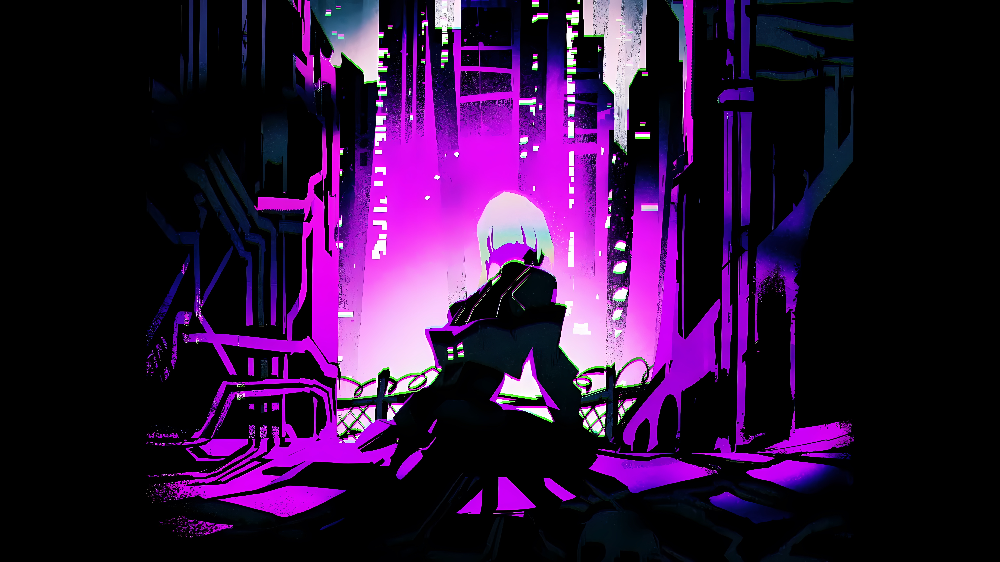

      
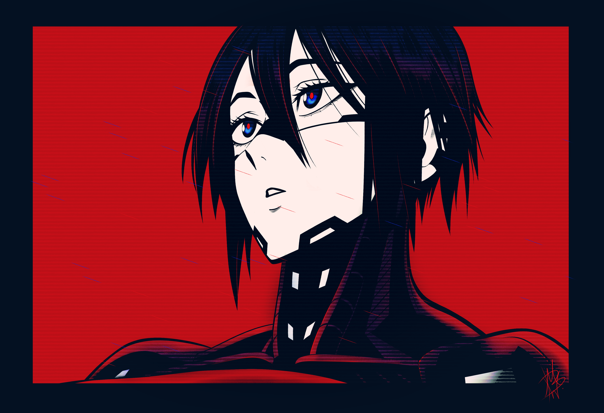

      
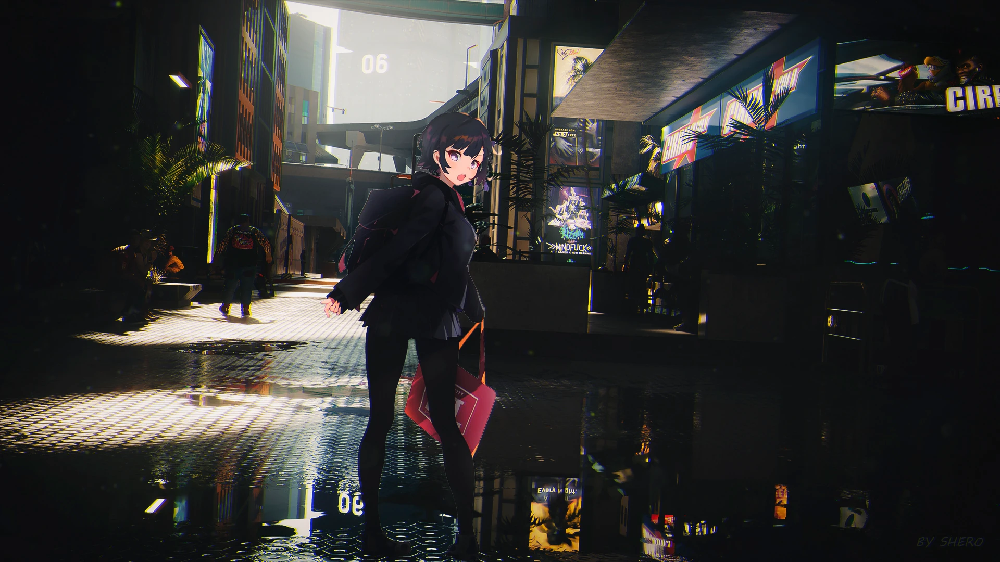

    

    <label class="ap-cyberpunk-0" for="r-cyberpunk-4" style="position:absolute;left:6px;top:50%;transform:translateY(-50%);width:32px;height:32px;background:rgba(13,17,23,0.75);border-radius:50%;align-items:center;justify-content:center;color:#c0caf5;font-size:18px;cursor:pointer;user-select:none;text-decoration:none;">&#9664;</label>
    <label class="ap-cyberpunk-1" for="r-cyberpunk-0" style="position:absolute;left:6px;top:50%;transform:translateY(-50%);width:32px;height:32px;background:rgba(13,17,23,0.75);border-radius:50%;align-items:center;justify-content:center;color:#c0caf5;font-size:18px;cursor:pointer;user-select:none;text-decoration:none;">&#9664;</label>
    <label class="ap-cyberpunk-2" for="r-cyberpunk-1" style="position:absolute;left:6px;top:50%;transform:translateY(-50%);width:32px;height:32px;background:rgba(13,17,23,0.75);border-radius:50%;align-items:center;justify-content:center;color:#c0caf5;font-size:18px;cursor:pointer;user-select:none;text-decoration:none;">&#9664;</label>
    <label class="ap-cyberpunk-3" for="r-cyberpunk-2" style="position:absolute;left:6px;top:50%;transform:translateY(-50%);width:32px;height:32px;background:rgba(13,17,23,0.75);border-radius:50%;align-items:center;justify-content:center;color:#c0caf5;font-size:18px;cursor:pointer;user-select:none;text-decoration:none;">&#9664;</label>
    <label class="ap-cyberpunk-4" for="r-cyberpunk-3" style="position:absolute;left:6px;top:50%;transform:translateY(-50%);width:32px;height:32px;background:rgba(13,17,23,0.75);border-radius:50%;align-items:center;justify-content:center;color:#c0caf5;font-size:18px;cursor:pointer;user-select:none;text-decoration:none;">&#9664;</label>
    <label class="an-cyberpunk-0" for="r-cyberpunk-1" style="position:absolute;right:6px;top:50%;transform:translateY(-50%);width:32px;height:32px;background:rgba(13,17,23,0.75);border-radius:50%;align-items:center;justify-content:center;color:#c0caf5;font-size:18px;cursor:pointer;user-select:none;text-decoration:none;">&#9654;</label>
    <label class="an-cyberpunk-1" for="r-cyberpunk-2" style="position:absolute;right:6px;top:50%;transform:translateY(-50%);width:32px;height:32px;background:rgba(13,17,23,0.75);border-radius:50%;align-items:center;justify-content:center;color:#c0caf5;font-size:18px;cursor:pointer;user-select:none;text-decoration:none;">&#9654;</label>
    <label class="an-cyberpunk-2" for="r-cyberpunk-3" style="position:absolute;right:6px;top:50%;transform:translateY(-50%);width:32px;height:32px;background:rgba(13,17,23,0.75);border-radius:50%;align-items:center;justify-content:center;color:#c0caf5;font-size:18px;cursor:pointer;user-select:none;text-decoration:none;">&#9654;</label>
    <label class="an-cyberpunk-3" for="r-cyberpunk-4" style="position:absolute;right:6px;top:50%;transform:translateY(-50%);width:32px;height:32px;background:rgba(13,17,23,0.75);border-radius:50%;align-items:center;justify-content:center;color:#c0caf5;font-size:18px;cursor:pointer;user-select:none;text-decoration:none;">&#9654;</label>
    <label class="an-cyberpunk-4" for="r-cyberpunk-0" style="position:absolute;right:6px;top:50%;transform:translateY(-50%);width:32px;height:32px;background:rgba(13,17,23,0.75);border-radius:50%;align-items:center;justify-content:center;color:#c0caf5;font-size:18px;cursor:pointer;user-select:none;text-decoration:none;">&#9654;</label>
    

      <label for="r-cyberpunk-0" style="width:10px;height:10px;background:#7aa2f7;border-radius:50%;cursor:pointer;display:inline-block;"></label>
      <label for="r-cyberpunk-1" style="width:10px;height:10px;background:#30363d;border-radius:50%;cursor:pointer;display:inline-block;"></label>
      <label for="r-cyberpunk-2" style="width:10px;height:10px;background:#30363d;border-radius:50%;cursor:pointer;display:inline-block;"></label>
      <label for="r-cyberpunk-3" style="width:10px;height:10px;background:#30363d;border-radius:50%;cursor:pointer;display:inline-block;"></label>
      <label for="r-cyberpunk-4" style="width:10px;height:10px;background:#30363d;border-radius:50%;cursor:pointer;display:inline-block;"></label>
    

  

---

  <h2>Dracula</h2>
  

    
  

  

    <input class="r-dracula" type="radio" name="s-dracula" id="r-dracula-0" checked>
    <input class="r-dracula" type="radio" name="s-dracula" id="r-dracula-1">
    <input class="r-dracula" type="radio" name="s-dracula" id="r-dracula-2">
    <input class="r-dracula" type="radio" name="s-dracula" id="r-dracula-3">
    <input class="r-dracula" type="radio" name="s-dracula" id="r-dracula-4">
    

      

      

      

      

      

    

    <label class="ap-dracula-0" for="r-dracula-4" style="position:absolute;left:6px;top:50%;transform:translateY(-50%);width:32px;height:32px;background:rgba(13,17,23,0.75);border-radius:50%;align-items:center;justify-content:center;color:#c0caf5;font-size:18px;cursor:pointer;user-select:none;text-decoration:none;">&#9664;</label>
    <label class="ap-dracula-1" for="r-dracula-0" style="position:absolute;left:6px;top:50%;transform:translateY(-50%);width:32px;height:32px;background:rgba(13,17,23,0.75);border-radius:50%;align-items:center;justify-content:center;color:#c0caf5;font-size:18px;cursor:pointer;user-select:none;text-decoration:none;">&#9664;</label>
    <label class="ap-dracula-2" for="r-dracula-1" style="position:absolute;left:6px;top:50%;transform:translateY(-50%);width:32px;height:32px;background:rgba(13,17,23,0.75);border-radius:50%;align-items:center;justify-content:center;color:#c0caf5;font-size:18px;cursor:pointer;user-select:none;text-decoration:none;">&#9664;</label>
    <label class="ap-dracula-3" for="r-dracula-2" style="position:absolute;left:6px;top:50%;transform:translateY(-50%);width:32px;height:32px;background:rgba(13,17,23,0.75);border-radius:50%;align-items:center;justify-content:center;color:#c0caf5;font-size:18px;cursor:pointer;user-select:none;text-decoration:none;">&#9664;</label>
    <label class="ap-dracula-4" for="r-dracula-3" style="position:absolute;left:6px;top:50%;transform:translateY(-50%);width:32px;height:32px;background:rgba(13,17,23,0.75);border-radius:50%;align-items:center;justify-content:center;color:#c0caf5;font-size:18px;cursor:pointer;user-select:none;text-decoration:none;">&#9664;</label>
    <label class="an-dracula-0" for="r-dracula-1" style="position:absolute;right:6px;top:50%;transform:translateY(-50%);width:32px;height:32px;background:rgba(13,17,23,0.75);border-radius:50%;align-items:center;justify-content:center;color:#c0caf5;font-size:18px;cursor:pointer;user-select:none;text-decoration:none;">&#9654;</label>
    <label class="an-dracula-1" for="r-dracula-2" style="position:absolute;right:6px;top:50%;transform:translateY(-50%);width:32px;height:32px;background:rgba(13,17,23,0.75);border-radius:50%;align-items:center;justify-content:center;color:#c0caf5;font-size:18px;cursor:pointer;user-select:none;text-decoration:none;">&#9654;</label>
    <label class="an-dracula-2" for="r-dracula-3" style="position:absolute;right:6px;top:50%;transform:translateY(-50%);width:32px;height:32px;background:rgba(13,17,23,0.75);border-radius:50%;align-items:center;justify-content:center;color:#c0caf5;font-size:18px;cursor:pointer;user-select:none;text-decoration:none;">&#9654;</label>
    <label class="an-dracula-3" for="r-dracula-4" style="position:absolute;right:6px;top:50%;transform:translateY(-50%);width:32px;height:32px;background:rgba(13,17,23,0.75);border-radius:50%;align-items:center;justify-content:center;color:#c0caf5;font-size:18px;cursor:pointer;user-select:none;text-decoration:none;">&#9654;</label>
    <label class="an-dracula-4" for="r-dracula-0" style="position:absolute;right:6px;top:50%;transform:translateY(-50%);width:32px;height:32px;background:rgba(13,17,23,0.75);border-radius:50%;align-items:center;justify-content:center;color:#c0caf5;font-size:18px;cursor:pointer;user-select:none;text-decoration:none;">&#9654;</label>
    

      <label for="r-dracula-0" style="width:10px;height:10px;background:#7aa2f7;border-radius:50%;cursor:pointer;display:inline-block;"></label>
      <label for="r-dracula-1" style="width:10px;height:10px;background:#30363d;border-radius:50%;cursor:pointer;display:inline-block;"></label>
      <label for="r-dracula-2" style="width:10px;height:10px;background:#30363d;border-radius:50%;cursor:pointer;display:inline-block;"></label>
      <label for="r-dracula-3" style="width:10px;height:10px;background:#30363d;border-radius:50%;cursor:pointer;display:inline-block;"></label>
      <label for="r-dracula-4" style="width:10px;height:10px;background:#30363d;border-radius:50%;cursor:pointer;display:inline-block;"></label>
    

  

---

  <h2>Everforest</h2>
  

    
  

  

    <input class="r-everforest" type="radio" name="s-everforest" id="r-everforest-0" checked>
    <input class="r-everforest" type="radio" name="s-everforest" id="r-everforest-1">
    <input class="r-everforest" type="radio" name="s-everforest" id="r-everforest-2">
    <input class="r-everforest" type="radio" name="s-everforest" id="r-everforest-3">
    <input class="r-everforest" type="radio" name="s-everforest" id="r-everforest-4">
    

      

      

      
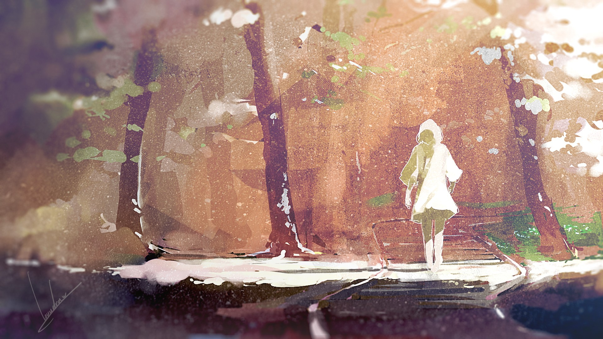

      

      
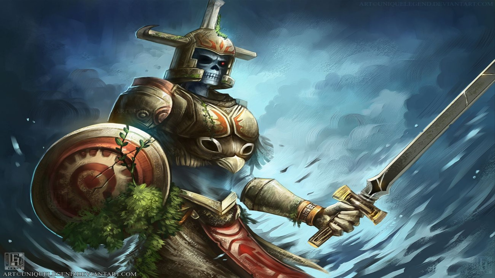

    

    <label class="ap-everforest-0" for="r-everforest-4" style="position:absolute;left:6px;top:50%;transform:translateY(-50%);width:32px;height:32px;background:rgba(13,17,23,0.75);border-radius:50%;align-items:center;justify-content:center;color:#c0caf5;font-size:18px;cursor:pointer;user-select:none;text-decoration:none;">&#9664;</label>
    <label class="ap-everforest-1" for="r-everforest-0" style="position:absolute;left:6px;top:50%;transform:translateY(-50%);width:32px;height:32px;background:rgba(13,17,23,0.75);border-radius:50%;align-items:center;justify-content:center;color:#c0caf5;font-size:18px;cursor:pointer;user-select:none;text-decoration:none;">&#9664;</label>
    <label class="ap-everforest-2" for="r-everforest-1" style="position:absolute;left:6px;top:50%;transform:translateY(-50%);width:32px;height:32px;background:rgba(13,17,23,0.75);border-radius:50%;align-items:center;justify-content:center;color:#c0caf5;font-size:18px;cursor:pointer;user-select:none;text-decoration:none;">&#9664;</label>
    <label class="ap-everforest-3" for="r-everforest-2" style="position:absolute;left:6px;top:50%;transform:translateY(-50%);width:32px;height:32px;background:rgba(13,17,23,0.75);border-radius:50%;align-items:center;justify-content:center;color:#c0caf5;font-size:18px;cursor:pointer;user-select:none;text-decoration:none;">&#9664;</label>
    <label class="ap-everforest-4" for="r-everforest-3" style="position:absolute;left:6px;top:50%;transform:translateY(-50%);width:32px;height:32px;background:rgba(13,17,23,0.75);border-radius:50%;align-items:center;justify-content:center;color:#c0caf5;font-size:18px;cursor:pointer;user-select:none;text-decoration:none;">&#9664;</label>
    <label class="an-everforest-0" for="r-everforest-1" style="position:absolute;right:6px;top:50%;transform:translateY(-50%);width:32px;height:32px;background:rgba(13,17,23,0.75);border-radius:50%;align-items:center;justify-content:center;color:#c0caf5;font-size:18px;cursor:pointer;user-select:none;text-decoration:none;">&#9654;</label>
    <label class="an-everforest-1" for="r-everforest-2" style="position:absolute;right:6px;top:50%;transform:translateY(-50%);width:32px;height:32px;background:rgba(13,17,23,0.75);border-radius:50%;align-items:center;justify-content:center;color:#c0caf5;font-size:18px;cursor:pointer;user-select:none;text-decoration:none;">&#9654;</label>
    <label class="an-everforest-2" for="r-everforest-3" style="position:absolute;right:6px;top:50%;transform:translateY(-50%);width:32px;height:32px;background:rgba(13,17,23,0.75);border-radius:50%;align-items:center;justify-content:center;color:#c0caf5;font-size:18px;cursor:pointer;user-select:none;text-decoration:none;">&#9654;</label>
    <label class="an-everforest-3" for="r-everforest-4" style="position:absolute;right:6px;top:50%;transform:translateY(-50%);width:32px;height:32px;background:rgba(13,17,23,0.75);border-radius:50%;align-items:center;justify-content:center;color:#c0caf5;font-size:18px;cursor:pointer;user-select:none;text-decoration:none;">&#9654;</label>
    <label class="an-everforest-4" for="r-everforest-0" style="position:absolute;right:6px;top:50%;transform:translateY(-50%);width:32px;height:32px;background:rgba(13,17,23,0.75);border-radius:50%;align-items:center;justify-content:center;color:#c0caf5;font-size:18px;cursor:pointer;user-select:none;text-decoration:none;">&#9654;</label>
    

      <label for="r-everforest-0" style="width:10px;height:10px;background:#7aa2f7;border-radius:50%;cursor:pointer;display:inline-block;"></label>
      <label for="r-everforest-1" style="width:10px;height:10px;background:#30363d;border-radius:50%;cursor:pointer;display:inline-block;"></label>
      <label for="r-everforest-2" style="width:10px;height:10px;background:#30363d;border-radius:50%;cursor:pointer;display:inline-block;"></label>
      <label for="r-everforest-3" style="width:10px;height:10px;background:#30363d;border-radius:50%;cursor:pointer;display:inline-block;"></label>
      <label for="r-everforest-4" style="width:10px;height:10px;background:#30363d;border-radius:50%;cursor:pointer;display:inline-block;"></label>
    

  

---

  <h2>Gruvbox</h2>
  

    
  

  

    <input class="r-gruvbox" type="radio" name="s-gruvbox" id="r-gruvbox-0" checked>
    <input class="r-gruvbox" type="radio" name="s-gruvbox" id="r-gruvbox-1">
    <input class="r-gruvbox" type="radio" name="s-gruvbox" id="r-gruvbox-2">
    <input class="r-gruvbox" type="radio" name="s-gruvbox" id="r-gruvbox-3">
    <input class="r-gruvbox" type="radio" name="s-gruvbox" id="r-gruvbox-4">
    

      

      

      

      

      
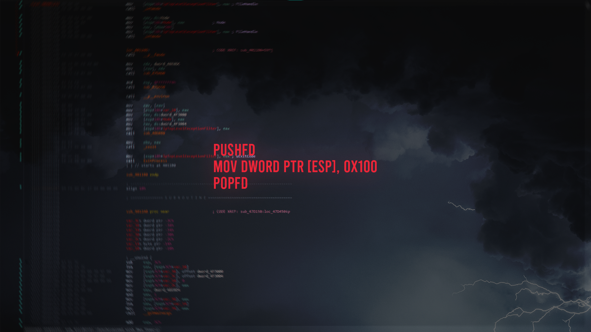

    

    <label class="ap-gruvbox-0" for="r-gruvbox-4" style="position:absolute;left:6px;top:50%;transform:translateY(-50%);width:32px;height:32px;background:rgba(13,17,23,0.75);border-radius:50%;align-items:center;justify-content:center;color:#c0caf5;font-size:18px;cursor:pointer;user-select:none;text-decoration:none;">&#9664;</label>
    <label class="ap-gruvbox-1" for="r-gruvbox-0" style="position:absolute;left:6px;top:50%;transform:translateY(-50%);width:32px;height:32px;background:rgba(13,17,23,0.75);border-radius:50%;align-items:center;justify-content:center;color:#c0caf5;font-size:18px;cursor:pointer;user-select:none;text-decoration:none;">&#9664;</label>
    <label class="ap-gruvbox-2" for="r-gruvbox-1" style="position:absolute;left:6px;top:50%;transform:translateY(-50%);width:32px;height:32px;background:rgba(13,17,23,0.75);border-radius:50%;align-items:center;justify-content:center;color:#c0caf5;font-size:18px;cursor:pointer;user-select:none;text-decoration:none;">&#9664;</label>
    <label class="ap-gruvbox-3" for="r-gruvbox-2" style="position:absolute;left:6px;top:50%;transform:translateY(-50%);width:32px;height:32px;background:rgba(13,17,23,0.75);border-radius:50%;align-items:center;justify-content:center;color:#c0caf5;font-size:18px;cursor:pointer;user-select:none;text-decoration:none;">&#9664;</label>
    <label class="ap-gruvbox-4" for="r-gruvbox-3" style="position:absolute;left:6px;top:50%;transform:translateY(-50%);width:32px;height:32px;background:rgba(13,17,23,0.75);border-radius:50%;align-items:center;justify-content:center;color:#c0caf5;font-size:18px;cursor:pointer;user-select:none;text-decoration:none;">&#9664;</label>
    <label class="an-gruvbox-0" for="r-gruvbox-1" style="position:absolute;right:6px;top:50%;transform:translateY(-50%);width:32px;height:32px;background:rgba(13,17,23,0.75);border-radius:50%;align-items:center;justify-content:center;color:#c0caf5;font-size:18px;cursor:pointer;user-select:none;text-decoration:none;">&#9654;</label>
    <label class="an-gruvbox-1" for="r-gruvbox-2" style="position:absolute;right:6px;top:50%;transform:translateY(-50%);width:32px;height:32px;background:rgba(13,17,23,0.75);border-radius:50%;align-items:center;justify-content:center;color:#c0caf5;font-size:18px;cursor:pointer;user-select:none;text-decoration:none;">&#9654;</label>
    <label class="an-gruvbox-2" for="r-gruvbox-3" style="position:absolute;right:6px;top:50%;transform:translateY(-50%);width:32px;height:32px;background:rgba(13,17,23,0.75);border-radius:50%;align-items:center;justify-content:center;color:#c0caf5;font-size:18px;cursor:pointer;user-select:none;text-decoration:none;">&#9654;</label>
    <label class="an-gruvbox-3" for="r-gruvbox-4" style="position:absolute;right:6px;top:50%;transform:translateY(-50%);width:32px;height:32px;background:rgba(13,17,23,0.75);border-radius:50%;align-items:center;justify-content:center;color:#c0caf5;font-size:18px;cursor:pointer;user-select:none;text-decoration:none;">&#9654;</label>
    <label class="an-gruvbox-4" for="r-gruvbox-0" style="position:absolute;right:6px;top:50%;transform:translateY(-50%);width:32px;height:32px;background:rgba(13,17,23,0.75);border-radius:50%;align-items:center;justify-content:center;color:#c0caf5;font-size:18px;cursor:pointer;user-select:none;text-decoration:none;">&#9654;</label>
    

      <label for="r-gruvbox-0" style="width:10px;height:10px;background:#7aa2f7;border-radius:50%;cursor:pointer;display:inline-block;"></label>
      <label for="r-gruvbox-1" style="width:10px;height:10px;background:#30363d;border-radius:50%;cursor:pointer;display:inline-block;"></label>
      <label for="r-gruvbox-2" style="width:10px;height:10px;background:#30363d;border-radius:50%;cursor:pointer;display:inline-block;"></label>
      <label for="r-gruvbox-3" style="width:10px;height:10px;background:#30363d;border-radius:50%;cursor:pointer;display:inline-block;"></label>
      <label for="r-gruvbox-4" style="width:10px;height:10px;background:#30363d;border-radius:50%;cursor:pointer;display:inline-block;"></label>
    

  

---

  <h2>Landscape</h2>
  

    
  

  

    <input class="r-landscape" type="radio" name="s-landscape" id="r-landscape-0" checked>
    <input class="r-landscape" type="radio" name="s-landscape" id="r-landscape-1">
    <input class="r-landscape" type="radio" name="s-landscape" id="r-landscape-2">
    <input class="r-landscape" type="radio" name="s-landscape" id="r-landscape-3">
    <input class="r-landscape" type="radio" name="s-landscape" id="r-landscape-4">
    

      
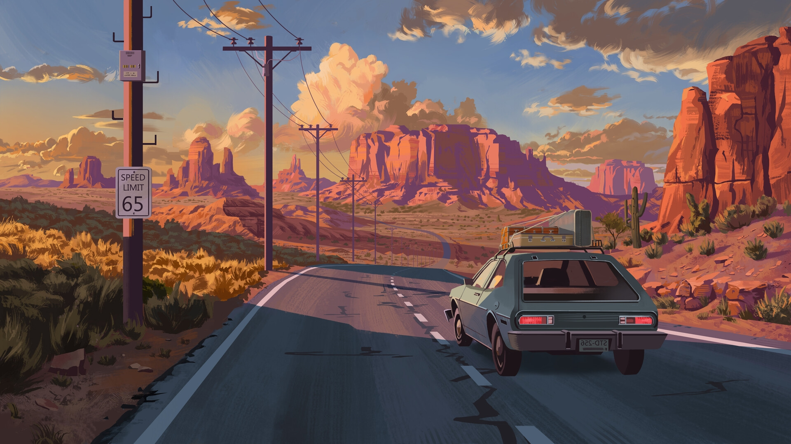

      

      
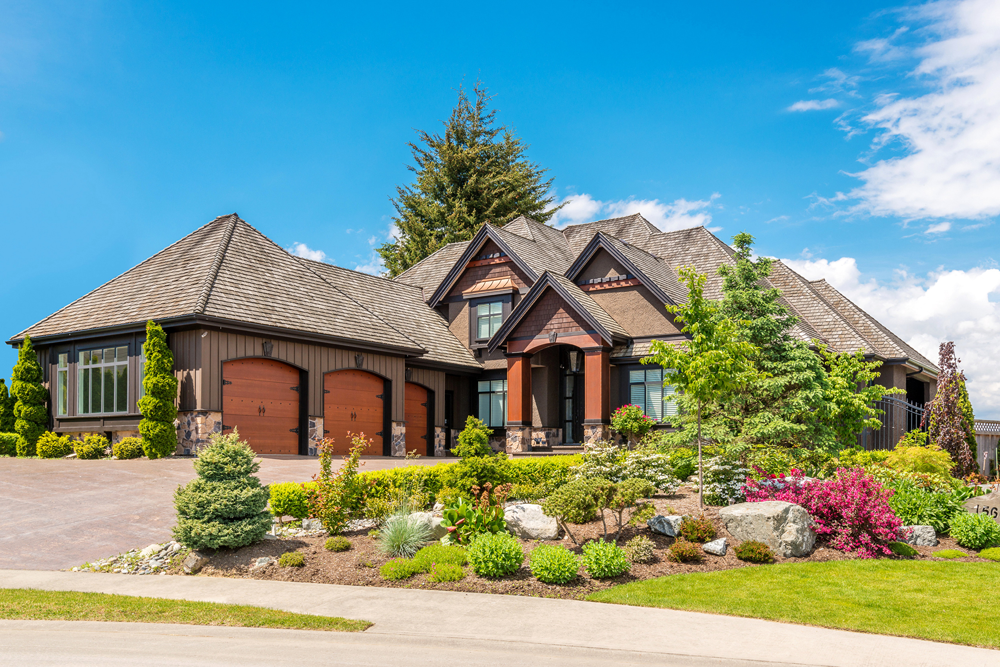

      

      
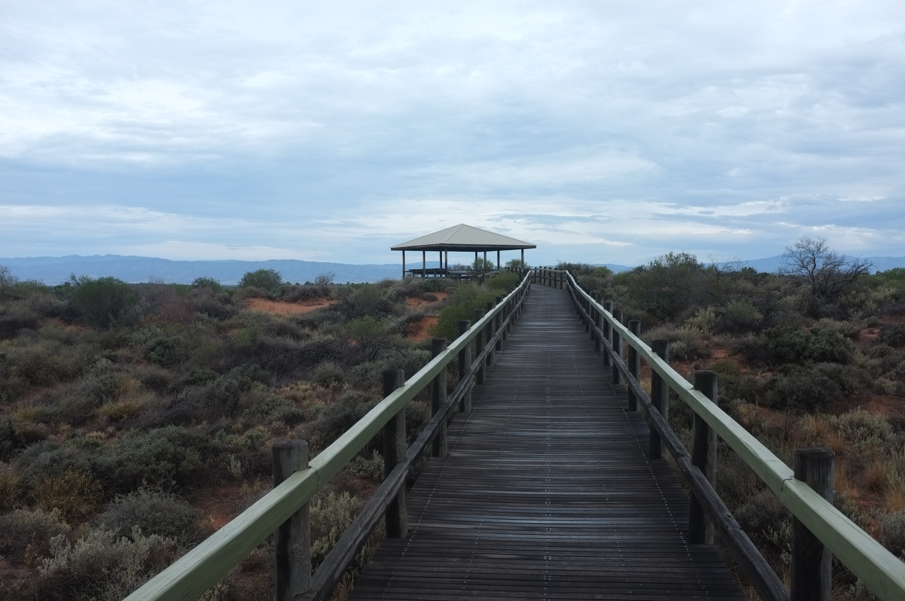

    

    <label class="ap-landscape-0" for="r-landscape-4" style="position:absolute;left:6px;top:50%;transform:translateY(-50%);width:32px;height:32px;background:rgba(13,17,23,0.75);border-radius:50%;align-items:center;justify-content:center;color:#c0caf5;font-size:18px;cursor:pointer;user-select:none;text-decoration:none;">&#9664;</label>
    <label class="ap-landscape-1" for="r-landscape-0" style="position:absolute;left:6px;top:50%;transform:translateY(-50%);width:32px;height:32px;background:rgba(13,17,23,0.75);border-radius:50%;align-items:center;justify-content:center;color:#c0caf5;font-size:18px;cursor:pointer;user-select:none;text-decoration:none;">&#9664;</label>
    <label class="ap-landscape-2" for="r-landscape-1" style="position:absolute;left:6px;top:50%;transform:translateY(-50%);width:32px;height:32px;background:rgba(13,17,23,0.75);border-radius:50%;align-items:center;justify-content:center;color:#c0caf5;font-size:18px;cursor:pointer;user-select:none;text-decoration:none;">&#9664;</label>
    <label class="ap-landscape-3" for="r-landscape-2" style="position:absolute;left:6px;top:50%;transform:translateY(-50%);width:32px;height:32px;background:rgba(13,17,23,0.75);border-radius:50%;align-items:center;justify-content:center;color:#c0caf5;font-size:18px;cursor:pointer;user-select:none;text-decoration:none;">&#9664;</label>
    <label class="ap-landscape-4" for="r-landscape-3" style="position:absolute;left:6px;top:50%;transform:translateY(-50%);width:32px;height:32px;background:rgba(13,17,23,0.75);border-radius:50%;align-items:center;justify-content:center;color:#c0caf5;font-size:18px;cursor:pointer;user-select:none;text-decoration:none;">&#9664;</label>
    <label class="an-landscape-0" for="r-landscape-1" style="position:absolute;right:6px;top:50%;transform:translateY(-50%);width:32px;height:32px;background:rgba(13,17,23,0.75);border-radius:50%;align-items:center;justify-content:center;color:#c0caf5;font-size:18px;cursor:pointer;user-select:none;text-decoration:none;">&#9654;</label>
    <label class="an-landscape-1" for="r-landscape-2" style="position:absolute;right:6px;top:50%;transform:translateY(-50%);width:32px;height:32px;background:rgba(13,17,23,0.75);border-radius:50%;align-items:center;justify-content:center;color:#c0caf5;font-size:18px;cursor:pointer;user-select:none;text-decoration:none;">&#9654;</label>
    <label class="an-landscape-2" for="r-landscape-3" style="position:absolute;right:6px;top:50%;transform:translateY(-50%);width:32px;height:32px;background:rgba(13,17,23,0.75);border-radius:50%;align-items:center;justify-content:center;color:#c0caf5;font-size:18px;cursor:pointer;user-select:none;text-decoration:none;">&#9654;</label>
    <label class="an-landscape-3" for="r-landscape-4" style="position:absolute;right:6px;top:50%;transform:translateY(-50%);width:32px;height:32px;background:rgba(13,17,23,0.75);border-radius:50%;align-items:center;justify-content:center;color:#c0caf5;font-size:18px;cursor:pointer;user-select:none;text-decoration:none;">&#9654;</label>
    <label class="an-landscape-4" for="r-landscape-0" style="position:absolute;right:6px;top:50%;transform:translateY(-50%);width:32px;height:32px;background:rgba(13,17,23,0.75);border-radius:50%;align-items:center;justify-content:center;color:#c0caf5;font-size:18px;cursor:pointer;user-select:none;text-decoration:none;">&#9654;</label>
    

      <label for="r-landscape-0" style="width:10px;height:10px;background:#7aa2f7;border-radius:50%;cursor:pointer;display:inline-block;"></label>
      <label for="r-landscape-1" style="width:10px;height:10px;background:#30363d;border-radius:50%;cursor:pointer;display:inline-block;"></label>
      <label for="r-landscape-2" style="width:10px;height:10px;background:#30363d;border-radius:50%;cursor:pointer;display:inline-block;"></label>
      <label for="r-landscape-3" style="width:10px;height:10px;background:#30363d;border-radius:50%;cursor:pointer;display:inline-block;"></label>
      <label for="r-landscape-4" style="width:10px;height:10px;background:#30363d;border-radius:50%;cursor:pointer;display:inline-block;"></label>
    

  

---

  <h2>Low-Quality</h2>
  

    
  

  

    <input class="r-lowquality" type="radio" name="s-lowquality" id="r-lowquality-0" checked>
    <input class="r-lowquality" type="radio" name="s-lowquality" id="r-lowquality-1">
    <input class="r-lowquality" type="radio" name="s-lowquality" id="r-lowquality-2">
    <input class="r-lowquality" type="radio" name="s-lowquality" id="r-lowquality-3">
    <input class="r-lowquality" type="radio" name="s-lowquality" id="r-lowquality-4">
    

      

      
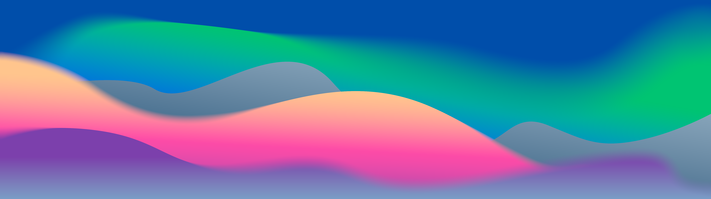

      

      

      

    

    <label class="ap-lowquality-0" for="r-lowquality-4" style="position:absolute;left:6px;top:50%;transform:translateY(-50%);width:32px;height:32px;background:rgba(13,17,23,0.75);border-radius:50%;align-items:center;justify-content:center;color:#c0caf5;font-size:18px;cursor:pointer;user-select:none;text-decoration:none;">&#9664;</label>
    <label class="ap-lowquality-1" for="r-lowquality-0" style="position:absolute;left:6px;top:50%;transform:translateY(-50%);width:32px;height:32px;background:rgba(13,17,23,0.75);border-radius:50%;align-items:center;justify-content:center;color:#c0caf5;font-size:18px;cursor:pointer;user-select:none;text-decoration:none;">&#9664;</label>
    <label class="ap-lowquality-2" for="r-lowquality-1" style="position:absolute;left:6px;top:50%;transform:translateY(-50%);width:32px;height:32px;background:rgba(13,17,23,0.75);border-radius:50%;align-items:center;justify-content:center;color:#c0caf5;font-size:18px;cursor:pointer;user-select:none;text-decoration:none;">&#9664;</label>
    <label class="ap-lowquality-3" for="r-lowquality-2" style="position:absolute;left:6px;top:50%;transform:translateY(-50%);width:32px;height:32px;background:rgba(13,17,23,0.75);border-radius:50%;align-items:center;justify-content:center;color:#c0caf5;font-size:18px;cursor:pointer;user-select:none;text-decoration:none;">&#9664;</label>
    <label class="ap-lowquality-4" for="r-lowquality-3" style="position:absolute;left:6px;top:50%;transform:translateY(-50%);width:32px;height:32px;background:rgba(13,17,23,0.75);border-radius:50%;align-items:center;justify-content:center;color:#c0caf5;font-size:18px;cursor:pointer;user-select:none;text-decoration:none;">&#9664;</label>
    <label class="an-lowquality-0" for="r-lowquality-1" style="position:absolute;right:6px;top:50%;transform:translateY(-50%);width:32px;height:32px;background:rgba(13,17,23,0.75);border-radius:50%;align-items:center;justify-content:center;color:#c0caf5;font-size:18px;cursor:pointer;user-select:none;text-decoration:none;">&#9654;</label>
    <label class="an-lowquality-1" for="r-lowquality-2" style="position:absolute;right:6px;top:50%;transform:translateY(-50%);width:32px;height:32px;background:rgba(13,17,23,0.75);border-radius:50%;align-items:center;justify-content:center;color:#c0caf5;font-size:18px;cursor:pointer;user-select:none;text-decoration:none;">&#9654;</label>
    <label class="an-lowquality-2" for="r-lowquality-3" style="position:absolute;right:6px;top:50%;transform:translateY(-50%);width:32px;height:32px;background:rgba(13,17,23,0.75);border-radius:50%;align-items:center;justify-content:center;color:#c0caf5;font-size:18px;cursor:pointer;user-select:none;text-decoration:none;">&#9654;</label>
    <label class="an-lowquality-3" for="r-lowquality-4" style="position:absolute;right:6px;top:50%;transform:translateY(-50%);width:32px;height:32px;background:rgba(13,17,23,0.75);border-radius:50%;align-items:center;justify-content:center;color:#c0caf5;font-size:18px;cursor:pointer;user-select:none;text-decoration:none;">&#9654;</label>
    <label class="an-lowquality-4" for="r-lowquality-0" style="position:absolute;right:6px;top:50%;transform:translateY(-50%);width:32px;height:32px;background:rgba(13,17,23,0.75);border-radius:50%;align-items:center;justify-content:center;color:#c0caf5;font-size:18px;cursor:pointer;user-select:none;text-decoration:none;">&#9654;</label>
    

      <label for="r-lowquality-0" style="width:10px;height:10px;background:#7aa2f7;border-radius:50%;cursor:pointer;display:inline-block;"></label>
      <label for="r-lowquality-1" style="width:10px;height:10px;background:#30363d;border-radius:50%;cursor:pointer;display:inline-block;"></label>
      <label for="r-lowquality-2" style="width:10px;height:10px;background:#30363d;border-radius:50%;cursor:pointer;display:inline-block;"></label>
      <label for="r-lowquality-3" style="width:10px;height:10px;background:#30363d;border-radius:50%;cursor:pointer;display:inline-block;"></label>
      <label for="r-lowquality-4" style="width:10px;height:10px;background:#30363d;border-radius:50%;cursor:pointer;display:inline-block;"></label>
    

  

---

  <h2>Minecraft</h2>
  

    
  

  

    <input class="r-minecraft" type="radio" name="s-minecraft" id="r-minecraft-0" checked>
    <input class="r-minecraft" type="radio" name="s-minecraft" id="r-minecraft-1">
    <input class="r-minecraft" type="radio" name="s-minecraft" id="r-minecraft-2">
    <input class="r-minecraft" type="radio" name="s-minecraft" id="r-minecraft-3">
    <input class="r-minecraft" type="radio" name="s-minecraft" id="r-minecraft-4">
    

      

      
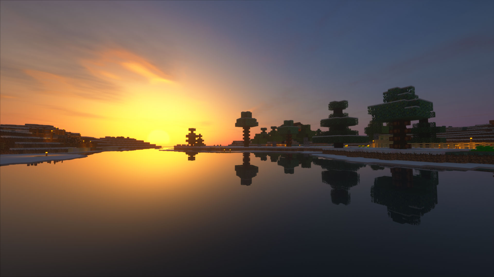

      
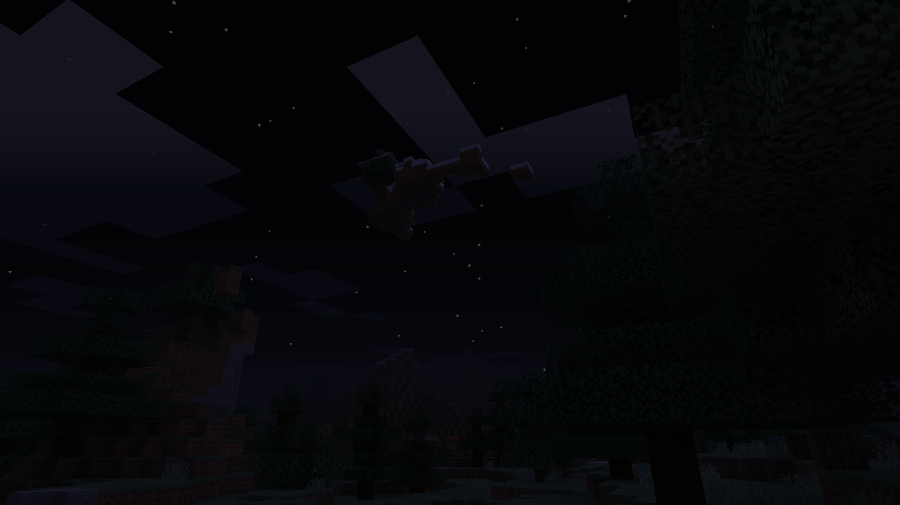

      

      

    

    <label class="ap-minecraft-0" for="r-minecraft-4" style="position:absolute;left:6px;top:50%;transform:translateY(-50%);width:32px;height:32px;background:rgba(13,17,23,0.75);border-radius:50%;align-items:center;justify-content:center;color:#c0caf5;font-size:18px;cursor:pointer;user-select:none;text-decoration:none;">&#9664;</label>
    <label class="ap-minecraft-1" for="r-minecraft-0" style="position:absolute;left:6px;top:50%;transform:translateY(-50%);width:32px;height:32px;background:rgba(13,17,23,0.75);border-radius:50%;align-items:center;justify-content:center;color:#c0caf5;font-size:18px;cursor:pointer;user-select:none;text-decoration:none;">&#9664;</label>
    <label class="ap-minecraft-2" for="r-minecraft-1" style="position:absolute;left:6px;top:50%;transform:translateY(-50%);width:32px;height:32px;background:rgba(13,17,23,0.75);border-radius:50%;align-items:center;justify-content:center;color:#c0caf5;font-size:18px;cursor:pointer;user-select:none;text-decoration:none;">&#9664;</label>
    <label class="ap-minecraft-3" for="r-minecraft-2" style="position:absolute;left:6px;top:50%;transform:translateY(-50%);width:32px;height:32px;background:rgba(13,17,23,0.75);border-radius:50%;align-items:center;justify-content:center;color:#c0caf5;font-size:18px;cursor:pointer;user-select:none;text-decoration:none;">&#9664;</label>
    <label class="ap-minecraft-4" for="r-minecraft-3" style="position:absolute;left:6px;top:50%;transform:translateY(-50%);width:32px;height:32px;background:rgba(13,17,23,0.75);border-radius:50%;align-items:center;justify-content:center;color:#c0caf5;font-size:18px;cursor:pointer;user-select:none;text-decoration:none;">&#9664;</label>
    <label class="an-minecraft-0" for="r-minecraft-1" style="position:absolute;right:6px;top:50%;transform:translateY(-50%);width:32px;height:32px;background:rgba(13,17,23,0.75);border-radius:50%;align-items:center;justify-content:center;color:#c0caf5;font-size:18px;cursor:pointer;user-select:none;text-decoration:none;">&#9654;</label>
    <label class="an-minecraft-1" for="r-minecraft-2" style="position:absolute;right:6px;top:50%;transform:translateY(-50%);width:32px;height:32px;background:rgba(13,17,23,0.75);border-radius:50%;align-items:center;justify-content:center;color:#c0caf5;font-size:18px;cursor:pointer;user-select:none;text-decoration:none;">&#9654;</label>
    <label class="an-minecraft-2" for="r-minecraft-3" style="position:absolute;right:6px;top:50%;transform:translateY(-50%);width:32px;height:32px;background:rgba(13,17,23,0.75);border-radius:50%;align-items:center;justify-content:center;color:#c0caf5;font-size:18px;cursor:pointer;user-select:none;text-decoration:none;">&#9654;</label>
    <label class="an-minecraft-3" for="r-minecraft-4" style="position:absolute;right:6px;top:50%;transform:translateY(-50%);width:32px;height:32px;background:rgba(13,17,23,0.75);border-radius:50%;align-items:center;justify-content:center;color:#c0caf5;font-size:18px;cursor:pointer;user-select:none;text-decoration:none;">&#9654;</label>
    <label class="an-minecraft-4" for="r-minecraft-0" style="position:absolute;right:6px;top:50%;transform:translateY(-50%);width:32px;height:32px;background:rgba(13,17,23,0.75);border-radius:50%;align-items:center;justify-content:center;color:#c0caf5;font-size:18px;cursor:pointer;user-select:none;text-decoration:none;">&#9654;</label>
    

      <label for="r-minecraft-0" style="width:10px;height:10px;background:#7aa2f7;border-radius:50%;cursor:pointer;display:inline-block;"></label>
      <label for="r-minecraft-1" style="width:10px;height:10px;background:#30363d;border-radius:50%;cursor:pointer;display:inline-block;"></label>
      <label for="r-minecraft-2" style="width:10px;height:10px;background:#30363d;border-radius:50%;cursor:pointer;display:inline-block;"></label>
      <label for="r-minecraft-3" style="width:10px;height:10px;background:#30363d;border-radius:50%;cursor:pointer;display:inline-block;"></label>
      <label for="r-minecraft-4" style="width:10px;height:10px;background:#30363d;border-radius:50%;cursor:pointer;display:inline-block;"></label>
    

  

---

  <h2>Minimalist</h2>
  

    
  

  

    <input class="r-minimalist" type="radio" name="s-minimalist" id="r-minimalist-0" checked>
    <input class="r-minimalist" type="radio" name="s-minimalist" id="r-minimalist-1">
    <input class="r-minimalist" type="radio" name="s-minimalist" id="r-minimalist-2">
    <input class="r-minimalist" type="radio" name="s-minimalist" id="r-minimalist-3">
    <input class="r-minimalist" type="radio" name="s-minimalist" id="r-minimalist-4">
    

      
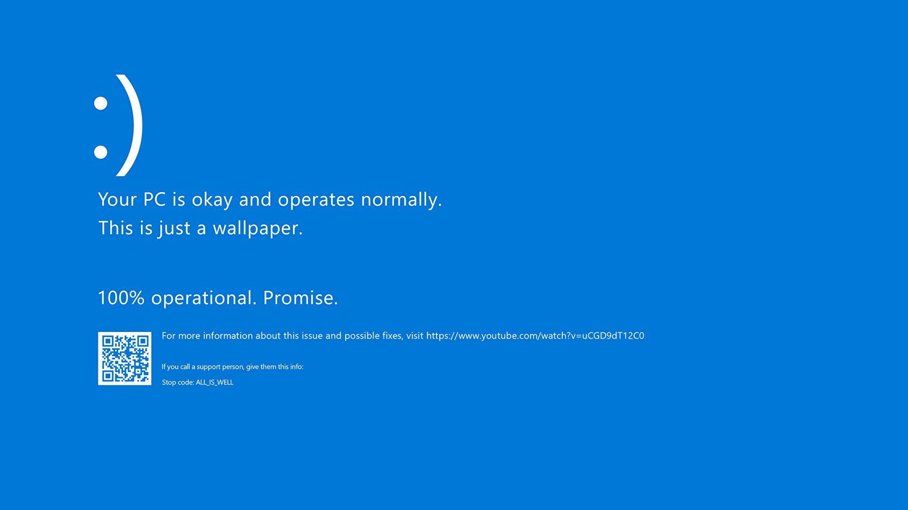

      
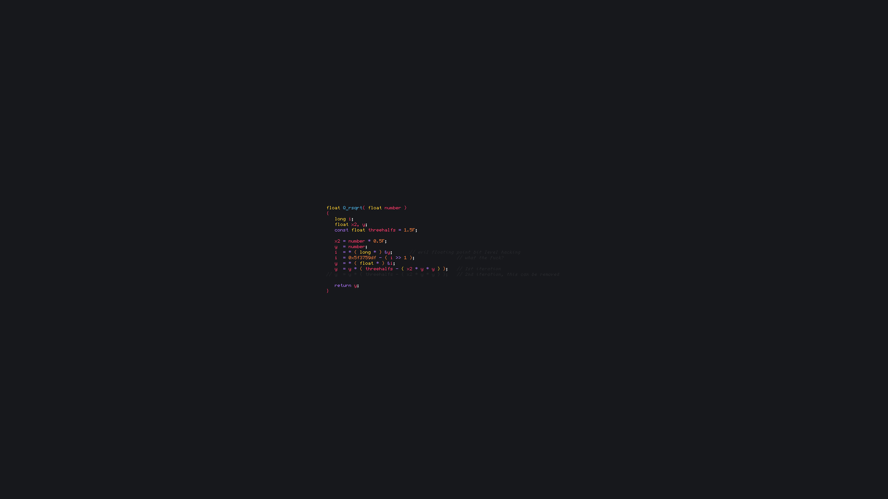

      
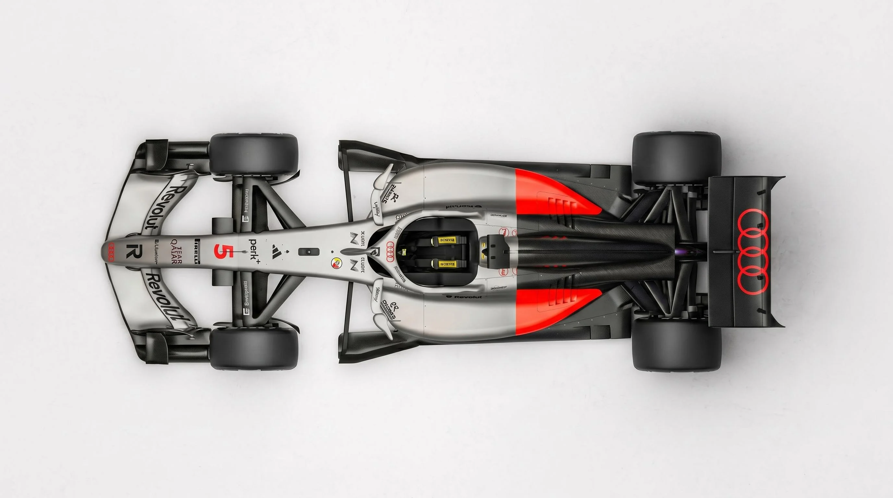

      
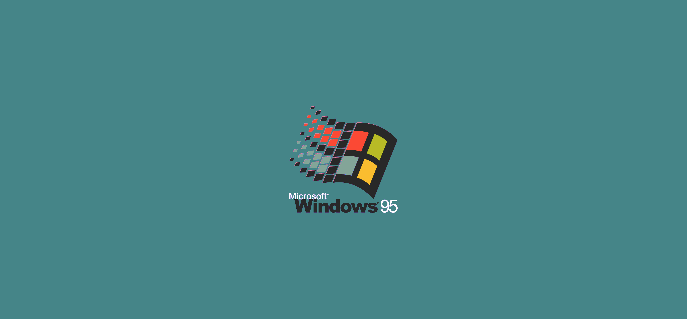

      
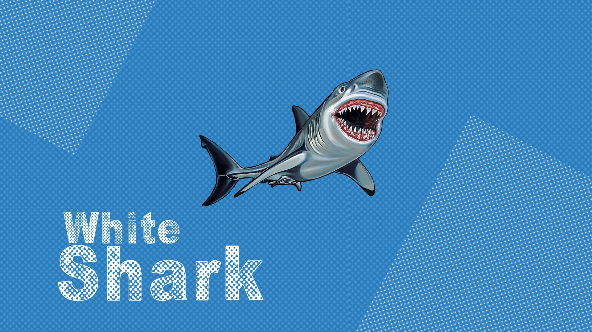

    

    <label class="ap-minimalist-0" for="r-minimalist-4" style="position:absolute;left:6px;top:50%;transform:translateY(-50%);width:32px;height:32px;background:rgba(13,17,23,0.75);border-radius:50%;align-items:center;justify-content:center;color:#c0caf5;font-size:18px;cursor:pointer;user-select:none;text-decoration:none;">&#9664;</label>
    <label class="ap-minimalist-1" for="r-minimalist-0" style="position:absolute;left:6px;top:50%;transform:translateY(-50%);width:32px;height:32px;background:rgba(13,17,23,0.75);border-radius:50%;align-items:center;justify-content:center;color:#c0caf5;font-size:18px;cursor:pointer;user-select:none;text-decoration:none;">&#9664;</label>
    <label class="ap-minimalist-2" for="r-minimalist-1" style="position:absolute;left:6px;top:50%;transform:translateY(-50%);width:32px;height:32px;background:rgba(13,17,23,0.75);border-radius:50%;align-items:center;justify-content:center;color:#c0caf5;font-size:18px;cursor:pointer;user-select:none;text-decoration:none;">&#9664;</label>
    <label class="ap-minimalist-3" for="r-minimalist-2" style="position:absolute;left:6px;top:50%;transform:translateY(-50%);width:32px;height:32px;background:rgba(13,17,23,0.75);border-radius:50%;align-items:center;justify-content:center;color:#c0caf5;font-size:18px;cursor:pointer;user-select:none;text-decoration:none;">&#9664;</label>
    <label class="ap-minimalist-4" for="r-minimalist-3" style="position:absolute;left:6px;top:50%;transform:translateY(-50%);width:32px;height:32px;background:rgba(13,17,23,0.75);border-radius:50%;align-items:center;justify-content:center;color:#c0caf5;font-size:18px;cursor:pointer;user-select:none;text-decoration:none;">&#9664;</label>
    <label class="an-minimalist-0" for="r-minimalist-1" style="position:absolute;right:6px;top:50%;transform:translateY(-50%);width:32px;height:32px;background:rgba(13,17,23,0.75);border-radius:50%;align-items:center;justify-content:center;color:#c0caf5;font-size:18px;cursor:pointer;user-select:none;text-decoration:none;">&#9654;</label>
    <label class="an-minimalist-1" for="r-minimalist-2" style="position:absolute;right:6px;top:50%;transform:translateY(-50%);width:32px;height:32px;background:rgba(13,17,23,0.75);border-radius:50%;align-items:center;justify-content:center;color:#c0caf5;font-size:18px;cursor:pointer;user-select:none;text-decoration:none;">&#9654;</label>
    <label class="an-minimalist-2" for="r-minimalist-3" style="position:absolute;right:6px;top:50%;transform:translateY(-50%);width:32px;height:32px;background:rgba(13,17,23,0.75);border-radius:50%;align-items:center;justify-content:center;color:#c0caf5;font-size:18px;cursor:pointer;user-select:none;text-decoration:none;">&#9654;</label>
    <label class="an-minimalist-3" for="r-minimalist-4" style="position:absolute;right:6px;top:50%;transform:translateY(-50%);width:32px;height:32px;background:rgba(13,17,23,0.75);border-radius:50%;align-items:center;justify-content:center;color:#c0caf5;font-size:18px;cursor:pointer;user-select:none;text-decoration:none;">&#9654;</label>
    <label class="an-minimalist-4" for="r-minimalist-0" style="position:absolute;right:6px;top:50%;transform:translateY(-50%);width:32px;height:32px;background:rgba(13,17,23,0.75);border-radius:50%;align-items:center;justify-content:center;color:#c0caf5;font-size:18px;cursor:pointer;user-select:none;text-decoration:none;">&#9654;</label>
    

      <label for="r-minimalist-0" style="width:10px;height:10px;background:#7aa2f7;border-radius:50%;cursor:pointer;display:inline-block;"></label>
      <label for="r-minimalist-1" style="width:10px;height:10px;background:#30363d;border-radius:50%;cursor:pointer;display:inline-block;"></label>
      <label for="r-minimalist-2" style="width:10px;height:10px;background:#30363d;border-radius:50%;cursor:pointer;display:inline-block;"></label>
      <label for="r-minimalist-3" style="width:10px;height:10px;background:#30363d;border-radius:50%;cursor:pointer;display:inline-block;"></label>
      <label for="r-minimalist-4" style="width:10px;height:10px;background:#30363d;border-radius:50%;cursor:pointer;display:inline-block;"></label>
    

  

---

  <h2>Monochrome</h2>
  

    
  

  

    <input class="r-monochrome" type="radio" name="s-monochrome" id="r-monochrome-0" checked>
    <input class="r-monochrome" type="radio" name="s-monochrome" id="r-monochrome-1">
    <input class="r-monochrome" type="radio" name="s-monochrome" id="r-monochrome-2">
    <input class="r-monochrome" type="radio" name="s-monochrome" id="r-monochrome-3">
    <input class="r-monochrome" type="radio" name="s-monochrome" id="r-monochrome-4">
    

      
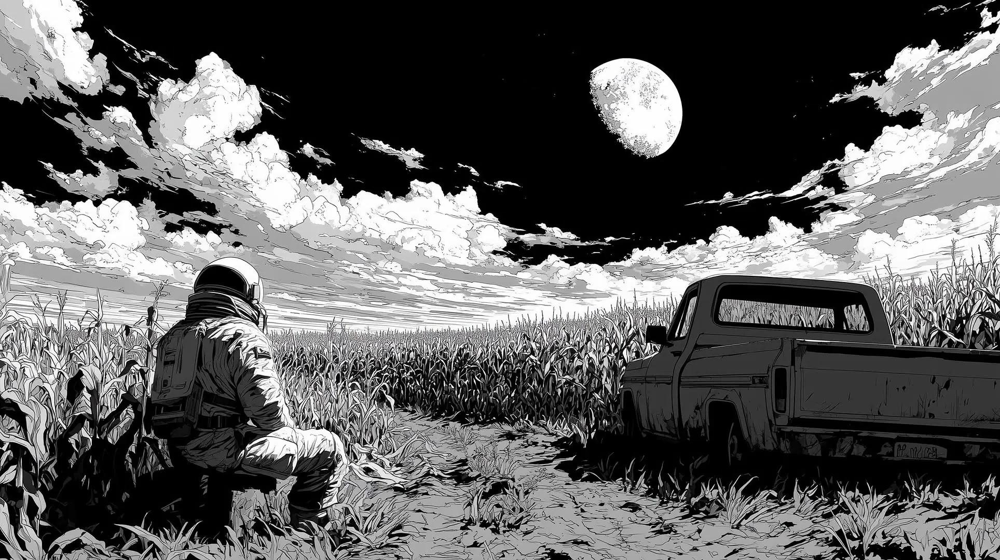

      
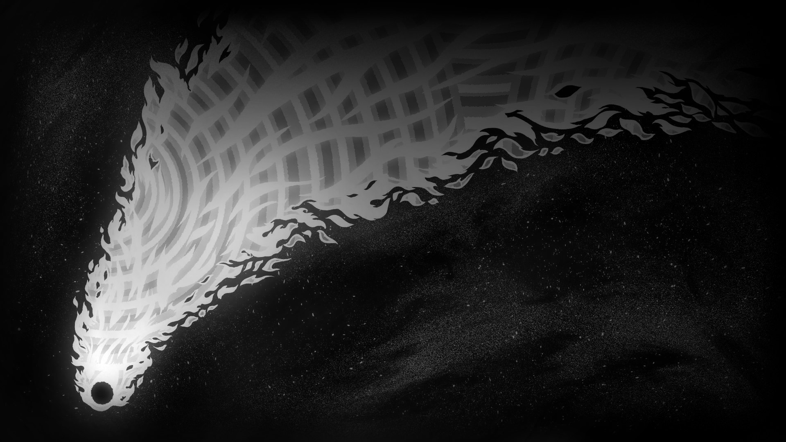

      

      
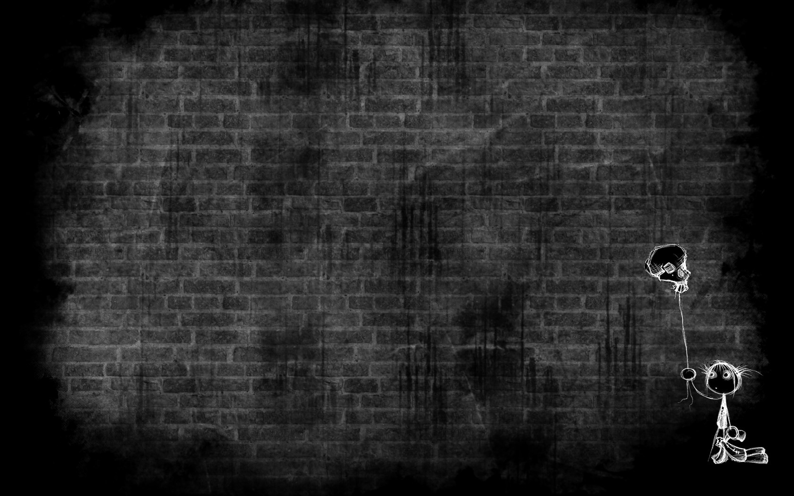

      
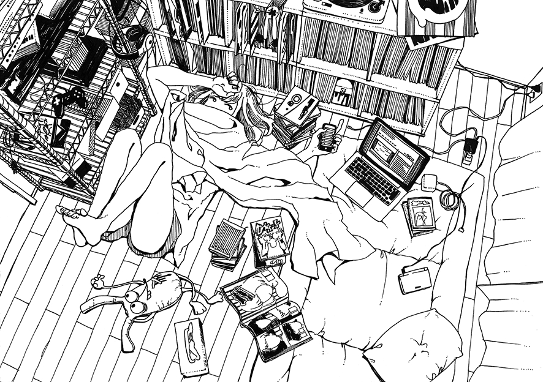

    

    <label class="ap-monochrome-0" for="r-monochrome-4" style="position:absolute;left:6px;top:50%;transform:translateY(-50%);width:32px;height:32px;background:rgba(13,17,23,0.75);border-radius:50%;align-items:center;justify-content:center;color:#c0caf5;font-size:18px;cursor:pointer;user-select:none;text-decoration:none;">&#9664;</label>
    <label class="ap-monochrome-1" for="r-monochrome-0" style="position:absolute;left:6px;top:50%;transform:translateY(-50%);width:32px;height:32px;background:rgba(13,17,23,0.75);border-radius:50%;align-items:center;justify-content:center;color:#c0caf5;font-size:18px;cursor:pointer;user-select:none;text-decoration:none;">&#9664;</label>
    <label class="ap-monochrome-2" for="r-monochrome-1" style="position:absolute;left:6px;top:50%;transform:translateY(-50%);width:32px;height:32px;background:rgba(13,17,23,0.75);border-radius:50%;align-items:center;justify-content:center;color:#c0caf5;font-size:18px;cursor:pointer;user-select:none;text-decoration:none;">&#9664;</label>
    <label class="ap-monochrome-3" for="r-monochrome-2" style="position:absolute;left:6px;top:50%;transform:translateY(-50%);width:32px;height:32px;background:rgba(13,17,23,0.75);border-radius:50%;align-items:center;justify-content:center;color:#c0caf5;font-size:18px;cursor:pointer;user-select:none;text-decoration:none;">&#9664;</label>
    <label class="ap-monochrome-4" for="r-monochrome-3" style="position:absolute;left:6px;top:50%;transform:translateY(-50%);width:32px;height:32px;background:rgba(13,17,23,0.75);border-radius:50%;align-items:center;justify-content:center;color:#c0caf5;font-size:18px;cursor:pointer;user-select:none;text-decoration:none;">&#9664;</label>
    <label class="an-monochrome-0" for="r-monochrome-1" style="position:absolute;right:6px;top:50%;transform:translateY(-50%);width:32px;height:32px;background:rgba(13,17,23,0.75);border-radius:50%;align-items:center;justify-content:center;color:#c0caf5;font-size:18px;cursor:pointer;user-select:none;text-decoration:none;">&#9654;</label>
    <label class="an-monochrome-1" for="r-monochrome-2" style="position:absolute;right:6px;top:50%;transform:translateY(-50%);width:32px;height:32px;background:rgba(13,17,23,0.75);border-radius:50%;align-items:center;justify-content:center;color:#c0caf5;font-size:18px;cursor:pointer;user-select:none;text-decoration:none;">&#9654;</label>
    <label class="an-monochrome-2" for="r-monochrome-3" style="position:absolute;right:6px;top:50%;transform:translateY(-50%);width:32px;height:32px;background:rgba(13,17,23,0.75);border-radius:50%;align-items:center;justify-content:center;color:#c0caf5;font-size:18px;cursor:pointer;user-select:none;text-decoration:none;">&#9654;</label>
    <label class="an-monochrome-3" for="r-monochrome-4" style="position:absolute;right:6px;top:50%;transform:translateY(-50%);width:32px;height:32px;background:rgba(13,17,23,0.75);border-radius:50%;align-items:center;justify-content:center;color:#c0caf5;font-size:18px;cursor:pointer;user-select:none;text-decoration:none;">&#9654;</label>
    <label class="an-monochrome-4" for="r-monochrome-0" style="position:absolute;right:6px;top:50%;transform:translateY(-50%);width:32px;height:32px;background:rgba(13,17,23,0.75);border-radius:50%;align-items:center;justify-content:center;color:#c0caf5;font-size:18px;cursor:pointer;user-select:none;text-decoration:none;">&#9654;</label>
    

      <label for="r-monochrome-0" style="width:10px;height:10px;background:#7aa2f7;border-radius:50%;cursor:pointer;display:inline-block;"></label>
      <label for="r-monochrome-1" style="width:10px;height:10px;background:#30363d;border-radius:50%;cursor:pointer;display:inline-block;"></label>
      <label for="r-monochrome-2" style="width:10px;height:10px;background:#30363d;border-radius:50%;cursor:pointer;display:inline-block;"></label>
      <label for="r-monochrome-3" style="width:10px;height:10px;background:#30363d;border-radius:50%;cursor:pointer;display:inline-block;"></label>
      <label for="r-monochrome-4" style="width:10px;height:10px;background:#30363d;border-radius:50%;cursor:pointer;display:inline-block;"></label>
    

  

---

  <h2>NSFW</h2>
  

    
  

  
<strong>Adult content.</strong> Browse the <code>NSFW/</code> folder directly.

  

    <input class="r-nsfw" type="radio" name="s-nsfw" id="r-nsfw-0" checked>
    <input class="r-nsfw" type="radio" name="s-nsfw" id="r-nsfw-1">
    <input class="r-nsfw" type="radio" name="s-nsfw" id="r-nsfw-2">
    <input class="r-nsfw" type="radio" name="s-nsfw" id="r-nsfw-3">
    <input class="r-nsfw" type="radio" name="s-nsfw" id="r-nsfw-4">
    

      
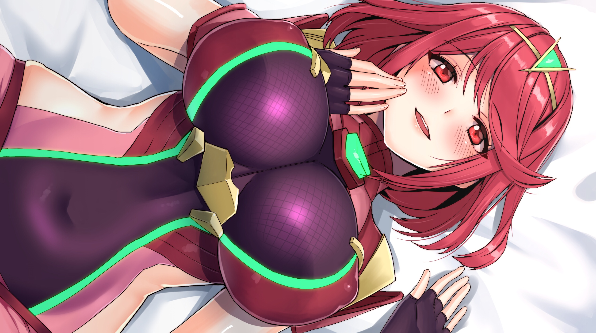

      

      

      

      

    

    <label class="ap-nsfw-0" for="r-nsfw-4" style="position:absolute;left:6px;top:50%;transform:translateY(-50%);width:32px;height:32px;background:rgba(13,17,23,0.75);border-radius:50%;align-items:center;justify-content:center;color:#c0caf5;font-size:18px;cursor:pointer;user-select:none;text-decoration:none;">&#9664;</label>
    <label class="ap-nsfw-1" for="r-nsfw-0" style="position:absolute;left:6px;top:50%;transform:translateY(-50%);width:32px;height:32px;background:rgba(13,17,23,0.75);border-radius:50%;align-items:center;justify-content:center;color:#c0caf5;font-size:18px;cursor:pointer;user-select:none;text-decoration:none;">&#9664;</label>
    <label class="ap-nsfw-2" for="r-nsfw-1" style="position:absolute;left:6px;top:50%;transform:translateY(-50%);width:32px;height:32px;background:rgba(13,17,23,0.75);border-radius:50%;align-items:center;justify-content:center;color:#c0caf5;font-size:18px;cursor:pointer;user-select:none;text-decoration:none;">&#9664;</label>
    <label class="ap-nsfw-3" for="r-nsfw-2" style="position:absolute;left:6px;top:50%;transform:translateY(-50%);width:32px;height:32px;background:rgba(13,17,23,0.75);border-radius:50%;align-items:center;justify-content:center;color:#c0caf5;font-size:18px;cursor:pointer;user-select:none;text-decoration:none;">&#9664;</label>
    <label class="ap-nsfw-4" for="r-nsfw-3" style="position:absolute;left:6px;top:50%;transform:translateY(-50%);width:32px;height:32px;background:rgba(13,17,23,0.75);border-radius:50%;align-items:center;justify-content:center;color:#c0caf5;font-size:18px;cursor:pointer;user-select:none;text-decoration:none;">&#9664;</label>
    <label class="an-nsfw-0" for="r-nsfw-1" style="position:absolute;right:6px;top:50%;transform:translateY(-50%);width:32px;height:32px;background:rgba(13,17,23,0.75);border-radius:50%;align-items:center;justify-content:center;color:#c0caf5;font-size:18px;cursor:pointer;user-select:none;text-decoration:none;">&#9654;</label>
    <label class="an-nsfw-1" for="r-nsfw-2" style="position:absolute;right:6px;top:50%;transform:translateY(-50%);width:32px;height:32px;background:rgba(13,17,23,0.75);border-radius:50%;align-items:center;justify-content:center;color:#c0caf5;font-size:18px;cursor:pointer;user-select:none;text-decoration:none;">&#9654;</label>
    <label class="an-nsfw-2" for="r-nsfw-3" style="position:absolute;right:6px;top:50%;transform:translateY(-50%);width:32px;height:32px;background:rgba(13,17,23,0.75);border-radius:50%;align-items:center;justify-content:center;color:#c0caf5;font-size:18px;cursor:pointer;user-select:none;text-decoration:none;">&#9654;</label>
    <label class="an-nsfw-3" for="r-nsfw-4" style="position:absolute;right:6px;top:50%;transform:translateY(-50%);width:32px;height:32px;background:rgba(13,17,23,0.75);border-radius:50%;align-items:center;justify-content:center;color:#c0caf5;font-size:18px;cursor:pointer;user-select:none;text-decoration:none;">&#9654;</label>
    <label class="an-nsfw-4" for="r-nsfw-0" style="position:absolute;right:6px;top:50%;transform:translateY(-50%);width:32px;height:32px;background:rgba(13,17,23,0.75);border-radius:50%;align-items:center;justify-content:center;color:#c0caf5;font-size:18px;cursor:pointer;user-select:none;text-decoration:none;">&#9654;</label>
    

      <label for="r-nsfw-0" style="width:10px;height:10px;background:#7aa2f7;border-radius:50%;cursor:pointer;display:inline-block;"></label>
      <label for="r-nsfw-1" style="width:10px;height:10px;background:#30363d;border-radius:50%;cursor:pointer;display:inline-block;"></label>
      <label for="r-nsfw-2" style="width:10px;height:10px;background:#30363d;border-radius:50%;cursor:pointer;display:inline-block;"></label>
      <label for="r-nsfw-3" style="width:10px;height:10px;background:#30363d;border-radius:50%;cursor:pointer;display:inline-block;"></label>
      <label for="r-nsfw-4" style="width:10px;height:10px;background:#30363d;border-radius:50%;cursor:pointer;display:inline-block;"></label>
    

  

---

  <h2>Neon</h2>
  

    
  

  

    <input class="r-neon" type="radio" name="s-neon" id="r-neon-0" checked>
    <input class="r-neon" type="radio" name="s-neon" id="r-neon-1">
    <input class="r-neon" type="radio" name="s-neon" id="r-neon-2">
    <input class="r-neon" type="radio" name="s-neon" id="r-neon-3">
    <input class="r-neon" type="radio" name="s-neon" id="r-neon-4">
    

      

      
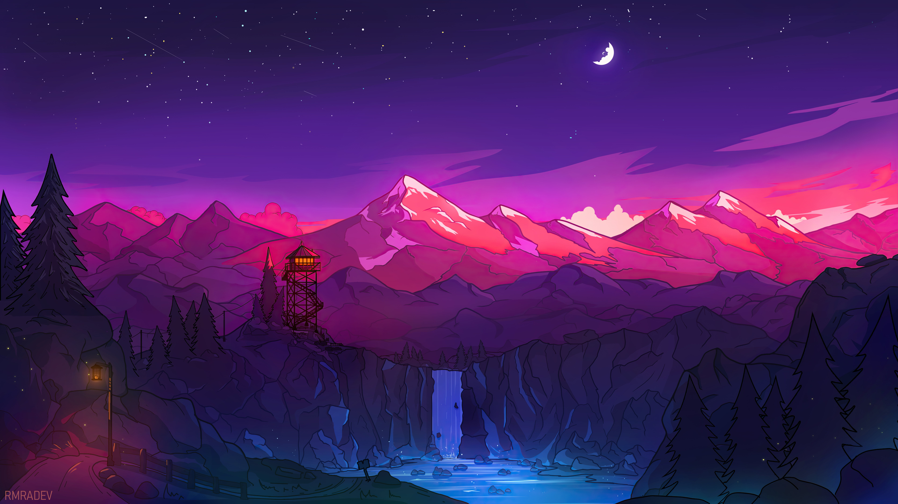

      
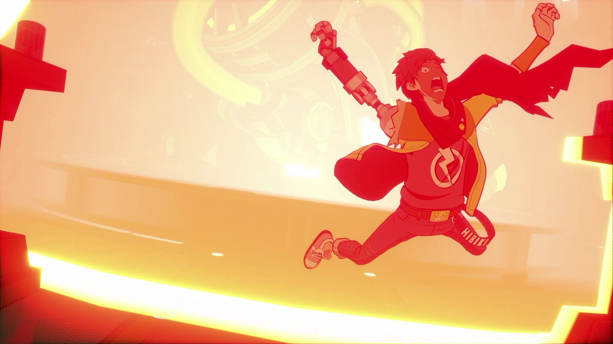

      
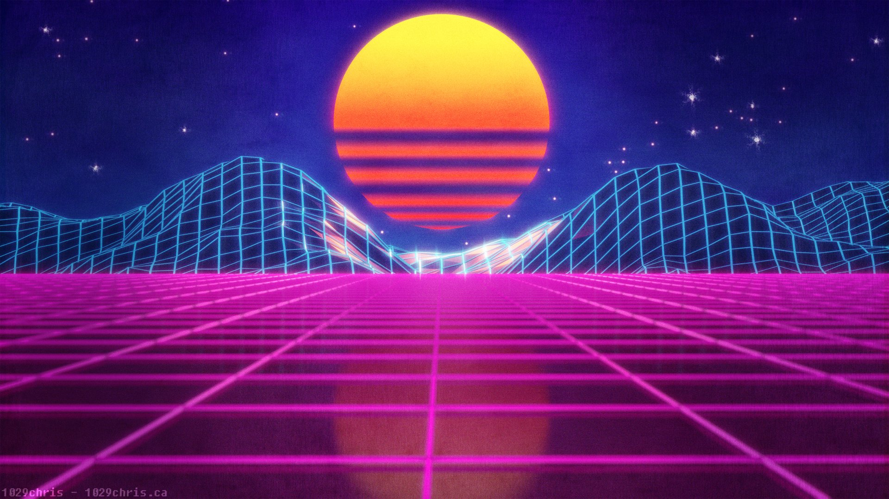

      

    

    <label class="ap-neon-0" for="r-neon-4" style="position:absolute;left:6px;top:50%;transform:translateY(-50%);width:32px;height:32px;background:rgba(13,17,23,0.75);border-radius:50%;align-items:center;justify-content:center;color:#c0caf5;font-size:18px;cursor:pointer;user-select:none;text-decoration:none;">&#9664;</label>
    <label class="ap-neon-1" for="r-neon-0" style="position:absolute;left:6px;top:50%;transform:translateY(-50%);width:32px;height:32px;background:rgba(13,17,23,0.75);border-radius:50%;align-items:center;justify-content:center;color:#c0caf5;font-size:18px;cursor:pointer;user-select:none;text-decoration:none;">&#9664;</label>
    <label class="ap-neon-2" for="r-neon-1" style="position:absolute;left:6px;top:50%;transform:translateY(-50%);width:32px;height:32px;background:rgba(13,17,23,0.75);border-radius:50%;align-items:center;justify-content:center;color:#c0caf5;font-size:18px;cursor:pointer;user-select:none;text-decoration:none;">&#9664;</label>
    <label class="ap-neon-3" for="r-neon-2" style="position:absolute;left:6px;top:50%;transform:translateY(-50%);width:32px;height:32px;background:rgba(13,17,23,0.75);border-radius:50%;align-items:center;justify-content:center;color:#c0caf5;font-size:18px;cursor:pointer;user-select:none;text-decoration:none;">&#9664;</label>
    <label class="ap-neon-4" for="r-neon-3" style="position:absolute;left:6px;top:50%;transform:translateY(-50%);width:32px;height:32px;background:rgba(13,17,23,0.75);border-radius:50%;align-items:center;justify-content:center;color:#c0caf5;font-size:18px;cursor:pointer;user-select:none;text-decoration:none;">&#9664;</label>
    <label class="an-neon-0" for="r-neon-1" style="position:absolute;right:6px;top:50%;transform:translateY(-50%);width:32px;height:32px;background:rgba(13,17,23,0.75);border-radius:50%;align-items:center;justify-content:center;color:#c0caf5;font-size:18px;cursor:pointer;user-select:none;text-decoration:none;">&#9654;</label>
    <label class="an-neon-1" for="r-neon-2" style="position:absolute;right:6px;top:50%;transform:translateY(-50%);width:32px;height:32px;background:rgba(13,17,23,0.75);border-radius:50%;align-items:center;justify-content:center;color:#c0caf5;font-size:18px;cursor:pointer;user-select:none;text-decoration:none;">&#9654;</label>
    <label class="an-neon-2" for="r-neon-3" style="position:absolute;right:6px;top:50%;transform:translateY(-50%);width:32px;height:32px;background:rgba(13,17,23,0.75);border-radius:50%;align-items:center;justify-content:center;color:#c0caf5;font-size:18px;cursor:pointer;user-select:none;text-decoration:none;">&#9654;</label>
    <label class="an-neon-3" for="r-neon-4" style="position:absolute;right:6px;top:50%;transform:translateY(-50%);width:32px;height:32px;background:rgba(13,17,23,0.75);border-radius:50%;align-items:center;justify-content:center;color:#c0caf5;font-size:18px;cursor:pointer;user-select:none;text-decoration:none;">&#9654;</label>
    <label class="an-neon-4" for="r-neon-0" style="position:absolute;right:6px;top:50%;transform:translateY(-50%);width:32px;height:32px;background:rgba(13,17,23,0.75);border-radius:50%;align-items:center;justify-content:center;color:#c0caf5;font-size:18px;cursor:pointer;user-select:none;text-decoration:none;">&#9654;</label>
    

      <label for="r-neon-0" style="width:10px;height:10px;background:#7aa2f7;border-radius:50%;cursor:pointer;display:inline-block;"></label>
      <label for="r-neon-1" style="width:10px;height:10px;background:#30363d;border-radius:50%;cursor:pointer;display:inline-block;"></label>
      <label for="r-neon-2" style="width:10px;height:10px;background:#30363d;border-radius:50%;cursor:pointer;display:inline-block;"></label>
      <label for="r-neon-3" style="width:10px;height:10px;background:#30363d;border-radius:50%;cursor:pointer;display:inline-block;"></label>
      <label for="r-neon-4" style="width:10px;height:10px;background:#30363d;border-radius:50%;cursor:pointer;display:inline-block;"></label>
    

  

---

  <h2>Nord</h2>
  

    
  

  

    <input class="r-nord" type="radio" name="s-nord" id="r-nord-0" checked>
    <input class="r-nord" type="radio" name="s-nord" id="r-nord-1">
    <input class="r-nord" type="radio" name="s-nord" id="r-nord-2">
    <input class="r-nord" type="radio" name="s-nord" id="r-nord-3">
    <input class="r-nord" type="radio" name="s-nord" id="r-nord-4">
    

      

      
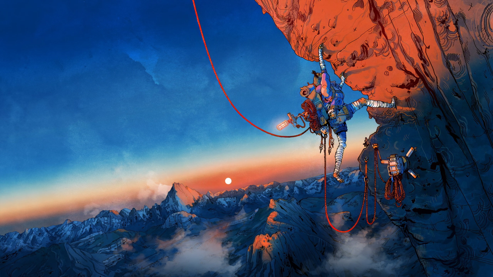

      

      

      

    

    <label class="ap-nord-0" for="r-nord-4" style="position:absolute;left:6px;top:50%;transform:translateY(-50%);width:32px;height:32px;background:rgba(13,17,23,0.75);border-radius:50%;align-items:center;justify-content:center;color:#c0caf5;font-size:18px;cursor:pointer;user-select:none;text-decoration:none;">&#9664;</label>
    <label class="ap-nord-1" for="r-nord-0" style="position:absolute;left:6px;top:50%;transform:translateY(-50%);width:32px;height:32px;background:rgba(13,17,23,0.75);border-radius:50%;align-items:center;justify-content:center;color:#c0caf5;font-size:18px;cursor:pointer;user-select:none;text-decoration:none;">&#9664;</label>
    <label class="ap-nord-2" for="r-nord-1" style="position:absolute;left:6px;top:50%;transform:translateY(-50%);width:32px;height:32px;background:rgba(13,17,23,0.75);border-radius:50%;align-items:center;justify-content:center;color:#c0caf5;font-size:18px;cursor:pointer;user-select:none;text-decoration:none;">&#9664;</label>
    <label class="ap-nord-3" for="r-nord-2" style="position:absolute;left:6px;top:50%;transform:translateY(-50%);width:32px;height:32px;background:rgba(13,17,23,0.75);border-radius:50%;align-items:center;justify-content:center;color:#c0caf5;font-size:18px;cursor:pointer;user-select:none;text-decoration:none;">&#9664;</label>
    <label class="ap-nord-4" for="r-nord-3" style="position:absolute;left:6px;top:50%;transform:translateY(-50%);width:32px;height:32px;background:rgba(13,17,23,0.75);border-radius:50%;align-items:center;justify-content:center;color:#c0caf5;font-size:18px;cursor:pointer;user-select:none;text-decoration:none;">&#9664;</label>
    <label class="an-nord-0" for="r-nord-1" style="position:absolute;right:6px;top:50%;transform:translateY(-50%);width:32px;height:32px;background:rgba(13,17,23,0.75);border-radius:50%;align-items:center;justify-content:center;color:#c0caf5;font-size:18px;cursor:pointer;user-select:none;text-decoration:none;">&#9654;</label>
    <label class="an-nord-1" for="r-nord-2" style="position:absolute;right:6px;top:50%;transform:translateY(-50%);width:32px;height:32px;background:rgba(13,17,23,0.75);border-radius:50%;align-items:center;justify-content:center;color:#c0caf5;font-size:18px;cursor:pointer;user-select:none;text-decoration:none;">&#9654;</label>
    <label class="an-nord-2" for="r-nord-3" style="position:absolute;right:6px;top:50%;transform:translateY(-50%);width:32px;height:32px;background:rgba(13,17,23,0.75);border-radius:50%;align-items:center;justify-content:center;color:#c0caf5;font-size:18px;cursor:pointer;user-select:none;text-decoration:none;">&#9654;</label>
    <label class="an-nord-3" for="r-nord-4" style="position:absolute;right:6px;top:50%;transform:translateY(-50%);width:32px;height:32px;background:rgba(13,17,23,0.75);border-radius:50%;align-items:center;justify-content:center;color:#c0caf5;font-size:18px;cursor:pointer;user-select:none;text-decoration:none;">&#9654;</label>
    <label class="an-nord-4" for="r-nord-0" style="position:absolute;right:6px;top:50%;transform:translateY(-50%);width:32px;height:32px;background:rgba(13,17,23,0.75);border-radius:50%;align-items:center;justify-content:center;color:#c0caf5;font-size:18px;cursor:pointer;user-select:none;text-decoration:none;">&#9654;</label>
    

      <label for="r-nord-0" style="width:10px;height:10px;background:#7aa2f7;border-radius:50%;cursor:pointer;display:inline-block;"></label>
      <label for="r-nord-1" style="width:10px;height:10px;background:#30363d;border-radius:50%;cursor:pointer;display:inline-block;"></label>
      <label for="r-nord-2" style="width:10px;height:10px;background:#30363d;border-radius:50%;cursor:pointer;display:inline-block;"></label>
      <label for="r-nord-3" style="width:10px;height:10px;background:#30363d;border-radius:50%;cursor:pointer;display:inline-block;"></label>
      <label for="r-nord-4" style="width:10px;height:10px;background:#30363d;border-radius:50%;cursor:pointer;display:inline-block;"></label>
    

  

---

  <h2>Phone</h2>
  

    
  

  

    <input class="r-phone" type="radio" name="s-phone" id="r-phone-0" checked>
    <input class="r-phone" type="radio" name="s-phone" id="r-phone-1">
    <input class="r-phone" type="radio" name="s-phone" id="r-phone-2">
    <input class="r-phone" type="radio" name="s-phone" id="r-phone-3">
    <input class="r-phone" type="radio" name="s-phone" id="r-phone-4">
    

      

      

      
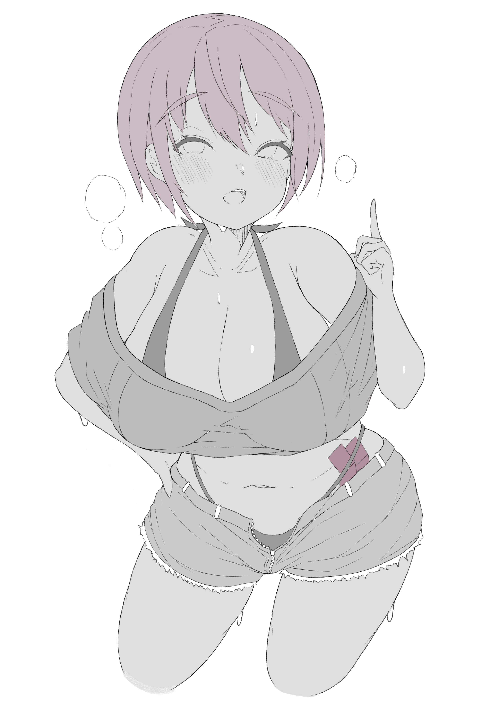

      

      
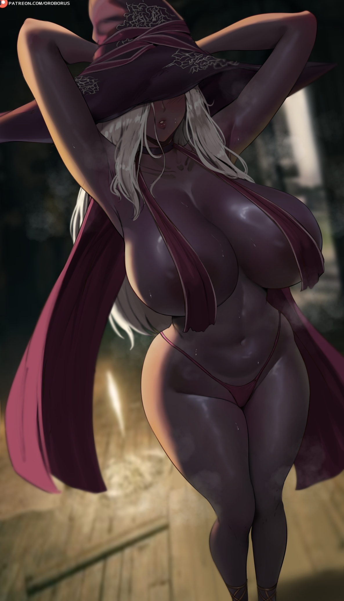

    

    <label class="ap-phone-0" for="r-phone-4" style="position:absolute;left:6px;top:50%;transform:translateY(-50%);width:32px;height:32px;background:rgba(13,17,23,0.75);border-radius:50%;align-items:center;justify-content:center;color:#c0caf5;font-size:18px;cursor:pointer;user-select:none;text-decoration:none;">&#9664;</label>
    <label class="ap-phone-1" for="r-phone-0" style="position:absolute;left:6px;top:50%;transform:translateY(-50%);width:32px;height:32px;background:rgba(13,17,23,0.75);border-radius:50%;align-items:center;justify-content:center;color:#c0caf5;font-size:18px;cursor:pointer;user-select:none;text-decoration:none;">&#9664;</label>
    <label class="ap-phone-2" for="r-phone-1" style="position:absolute;left:6px;top:50%;transform:translateY(-50%);width:32px;height:32px;background:rgba(13,17,23,0.75);border-radius:50%;align-items:center;justify-content:center;color:#c0caf5;font-size:18px;cursor:pointer;user-select:none;text-decoration:none;">&#9664;</label>
    <label class="ap-phone-3" for="r-phone-2" style="position:absolute;left:6px;top:50%;transform:translateY(-50%);width:32px;height:32px;background:rgba(13,17,23,0.75);border-radius:50%;align-items:center;justify-content:center;color:#c0caf5;font-size:18px;cursor:pointer;user-select:none;text-decoration:none;">&#9664;</label>
    <label class="ap-phone-4" for="r-phone-3" style="position:absolute;left:6px;top:50%;transform:translateY(-50%);width:32px;height:32px;background:rgba(13,17,23,0.75);border-radius:50%;align-items:center;justify-content:center;color:#c0caf5;font-size:18px;cursor:pointer;user-select:none;text-decoration:none;">&#9664;</label>
    <label class="an-phone-0" for="r-phone-1" style="position:absolute;right:6px;top:50%;transform:translateY(-50%);width:32px;height:32px;background:rgba(13,17,23,0.75);border-radius:50%;align-items:center;justify-content:center;color:#c0caf5;font-size:18px;cursor:pointer;user-select:none;text-decoration:none;">&#9654;</label>
    <label class="an-phone-1" for="r-phone-2" style="position:absolute;right:6px;top:50%;transform:translateY(-50%);width:32px;height:32px;background:rgba(13,17,23,0.75);border-radius:50%;align-items:center;justify-content:center;color:#c0caf5;font-size:18px;cursor:pointer;user-select:none;text-decoration:none;">&#9654;</label>
    <label class="an-phone-2" for="r-phone-3" style="position:absolute;right:6px;top:50%;transform:translateY(-50%);width:32px;height:32px;background:rgba(13,17,23,0.75);border-radius:50%;align-items:center;justify-content:center;color:#c0caf5;font-size:18px;cursor:pointer;user-select:none;text-decoration:none;">&#9654;</label>
    <label class="an-phone-3" for="r-phone-4" style="position:absolute;right:6px;top:50%;transform:translateY(-50%);width:32px;height:32px;background:rgba(13,17,23,0.75);border-radius:50%;align-items:center;justify-content:center;color:#c0caf5;font-size:18px;cursor:pointer;user-select:none;text-decoration:none;">&#9654;</label>
    <label class="an-phone-4" for="r-phone-0" style="position:absolute;right:6px;top:50%;transform:translateY(-50%);width:32px;height:32px;background:rgba(13,17,23,0.75);border-radius:50%;align-items:center;justify-content:center;color:#c0caf5;font-size:18px;cursor:pointer;user-select:none;text-decoration:none;">&#9654;</label>
    

      <label for="r-phone-0" style="width:10px;height:10px;background:#7aa2f7;border-radius:50%;cursor:pointer;display:inline-block;"></label>
      <label for="r-phone-1" style="width:10px;height:10px;background:#30363d;border-radius:50%;cursor:pointer;display:inline-block;"></label>
      <label for="r-phone-2" style="width:10px;height:10px;background:#30363d;border-radius:50%;cursor:pointer;display:inline-block;"></label>
      <label for="r-phone-3" style="width:10px;height:10px;background:#30363d;border-radius:50%;cursor:pointer;display:inline-block;"></label>
      <label for="r-phone-4" style="width:10px;height:10px;background:#30363d;border-radius:50%;cursor:pointer;display:inline-block;"></label>
    

  

---

  <h2>Pixel-Art</h2>
  

    
  

  

    <input class="r-pixelart" type="radio" name="s-pixelart" id="r-pixelart-0" checked>
    <input class="r-pixelart" type="radio" name="s-pixelart" id="r-pixelart-1">
    <input class="r-pixelart" type="radio" name="s-pixelart" id="r-pixelart-2">
    <input class="r-pixelart" type="radio" name="s-pixelart" id="r-pixelart-3">
    <input class="r-pixelart" type="radio" name="s-pixelart" id="r-pixelart-4">
    

      

      
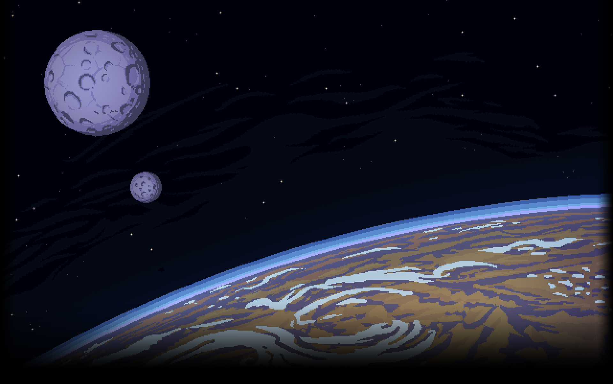

      
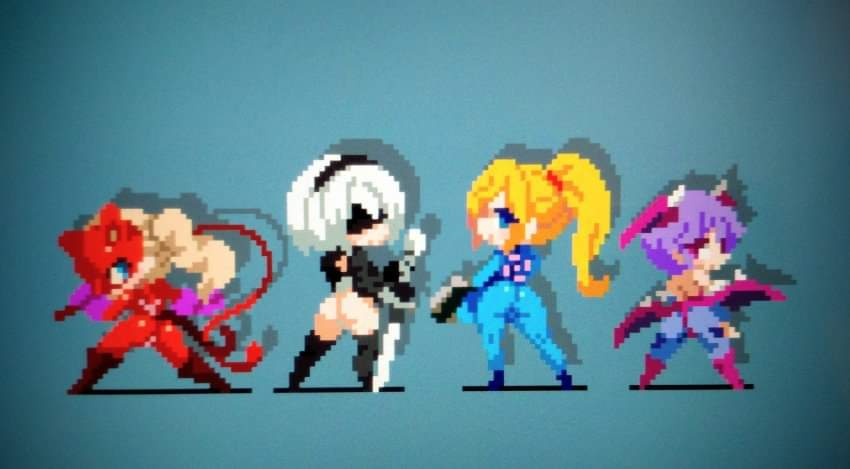

      
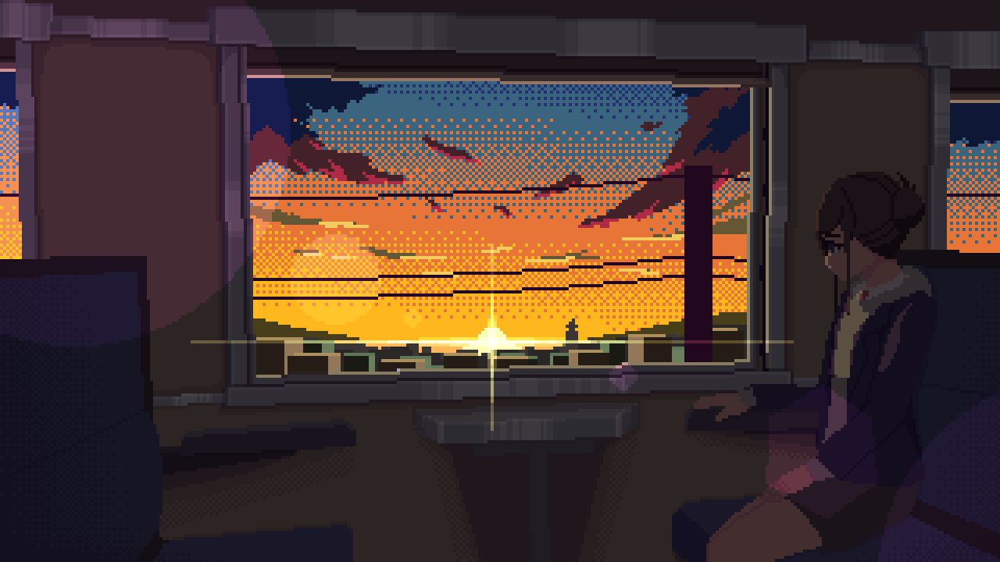

      
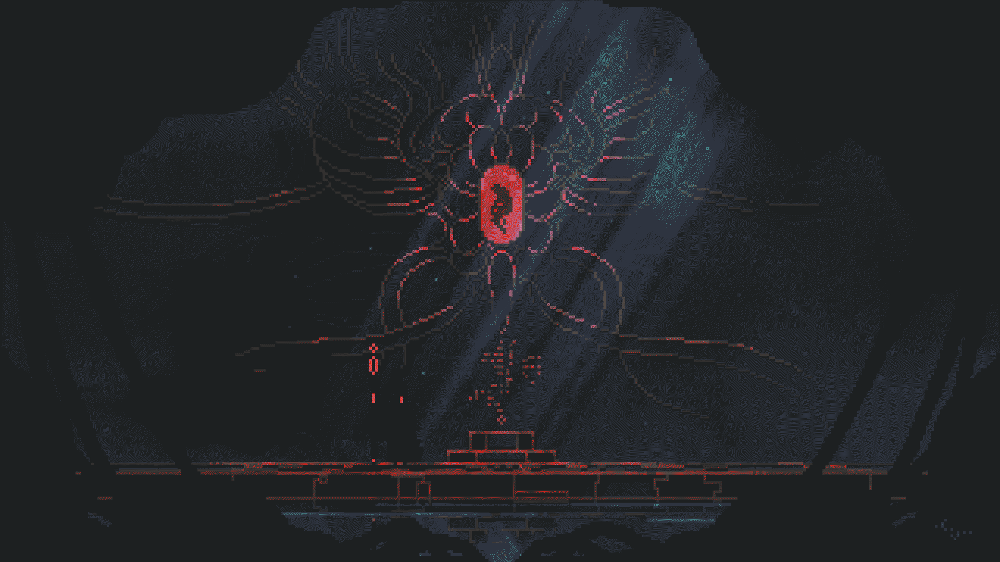

    

    <label class="ap-pixelart-0" for="r-pixelart-4" style="position:absolute;left:6px;top:50%;transform:translateY(-50%);width:32px;height:32px;background:rgba(13,17,23,0.75);border-radius:50%;align-items:center;justify-content:center;color:#c0caf5;font-size:18px;cursor:pointer;user-select:none;text-decoration:none;">&#9664;</label>
    <label class="ap-pixelart-1" for="r-pixelart-0" style="position:absolute;left:6px;top:50%;transform:translateY(-50%);width:32px;height:32px;background:rgba(13,17,23,0.75);border-radius:50%;align-items:center;justify-content:center;color:#c0caf5;font-size:18px;cursor:pointer;user-select:none;text-decoration:none;">&#9664;</label>
    <label class="ap-pixelart-2" for="r-pixelart-1" style="position:absolute;left:6px;top:50%;transform:translateY(-50%);width:32px;height:32px;background:rgba(13,17,23,0.75);border-radius:50%;align-items:center;justify-content:center;color:#c0caf5;font-size:18px;cursor:pointer;user-select:none;text-decoration:none;">&#9664;</label>
    <label class="ap-pixelart-3" for="r-pixelart-2" style="position:absolute;left:6px;top:50%;transform:translateY(-50%);width:32px;height:32px;background:rgba(13,17,23,0.75);border-radius:50%;align-items:center;justify-content:center;color:#c0caf5;font-size:18px;cursor:pointer;user-select:none;text-decoration:none;">&#9664;</label>
    <label class="ap-pixelart-4" for="r-pixelart-3" style="position:absolute;left:6px;top:50%;transform:translateY(-50%);width:32px;height:32px;background:rgba(13,17,23,0.75);border-radius:50%;align-items:center;justify-content:center;color:#c0caf5;font-size:18px;cursor:pointer;user-select:none;text-decoration:none;">&#9664;</label>
    <label class="an-pixelart-0" for="r-pixelart-1" style="position:absolute;right:6px;top:50%;transform:translateY(-50%);width:32px;height:32px;background:rgba(13,17,23,0.75);border-radius:50%;align-items:center;justify-content:center;color:#c0caf5;font-size:18px;cursor:pointer;user-select:none;text-decoration:none;">&#9654;</label>
    <label class="an-pixelart-1" for="r-pixelart-2" style="position:absolute;right:6px;top:50%;transform:translateY(-50%);width:32px;height:32px;background:rgba(13,17,23,0.75);border-radius:50%;align-items:center;justify-content:center;color:#c0caf5;font-size:18px;cursor:pointer;user-select:none;text-decoration:none;">&#9654;</label>
    <label class="an-pixelart-2" for="r-pixelart-3" style="position:absolute;right:6px;top:50%;transform:translateY(-50%);width:32px;height:32px;background:rgba(13,17,23,0.75);border-radius:50%;align-items:center;justify-content:center;color:#c0caf5;font-size:18px;cursor:pointer;user-select:none;text-decoration:none;">&#9654;</label>
    <label class="an-pixelart-3" for="r-pixelart-4" style="position:absolute;right:6px;top:50%;transform:translateY(-50%);width:32px;height:32px;background:rgba(13,17,23,0.75);border-radius:50%;align-items:center;justify-content:center;color:#c0caf5;font-size:18px;cursor:pointer;user-select:none;text-decoration:none;">&#9654;</label>
    <label class="an-pixelart-4" for="r-pixelart-0" style="position:absolute;right:6px;top:50%;transform:translateY(-50%);width:32px;height:32px;background:rgba(13,17,23,0.75);border-radius:50%;align-items:center;justify-content:center;color:#c0caf5;font-size:18px;cursor:pointer;user-select:none;text-decoration:none;">&#9654;</label>
    

      <label for="r-pixelart-0" style="width:10px;height:10px;background:#7aa2f7;border-radius:50%;cursor:pointer;display:inline-block;"></label>
      <label for="r-pixelart-1" style="width:10px;height:10px;background:#30363d;border-radius:50%;cursor:pointer;display:inline-block;"></label>
      <label for="r-pixelart-2" style="width:10px;height:10px;background:#30363d;border-radius:50%;cursor:pointer;display:inline-block;"></label>
      <label for="r-pixelart-3" style="width:10px;height:10px;background:#30363d;border-radius:50%;cursor:pointer;display:inline-block;"></label>
      <label for="r-pixelart-4" style="width:10px;height:10px;background:#30363d;border-radius:50%;cursor:pointer;display:inline-block;"></label>
    

  

---

  <h2>Space</h2>
  

    
  

  

    <input class="r-space" type="radio" name="s-space" id="r-space-0" checked>
    <input class="r-space" type="radio" name="s-space" id="r-space-1">
    <input class="r-space" type="radio" name="s-space" id="r-space-2">
    <input class="r-space" type="radio" name="s-space" id="r-space-3">
    <input class="r-space" type="radio" name="s-space" id="r-space-4">
    

      
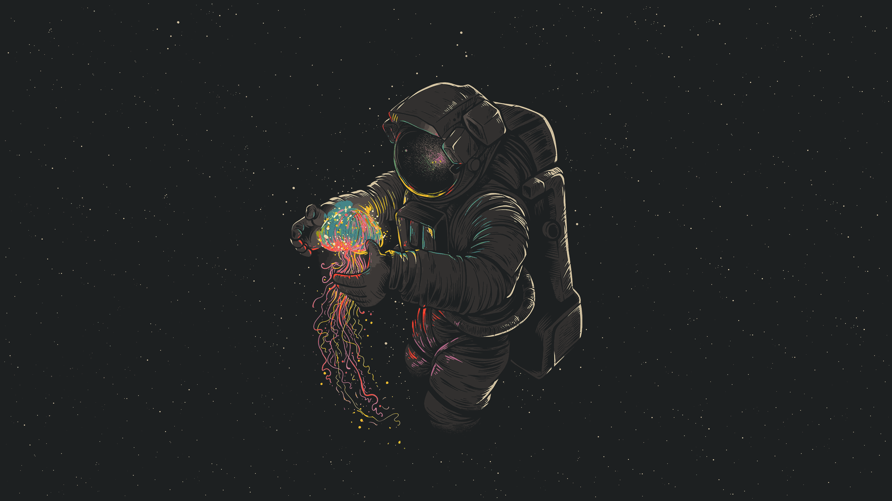

      

      
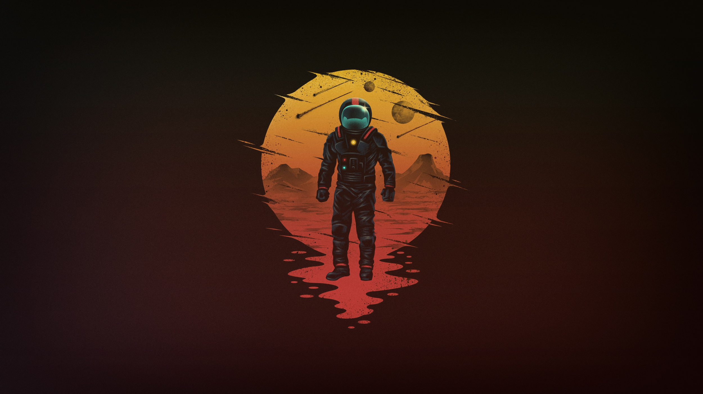

      

      
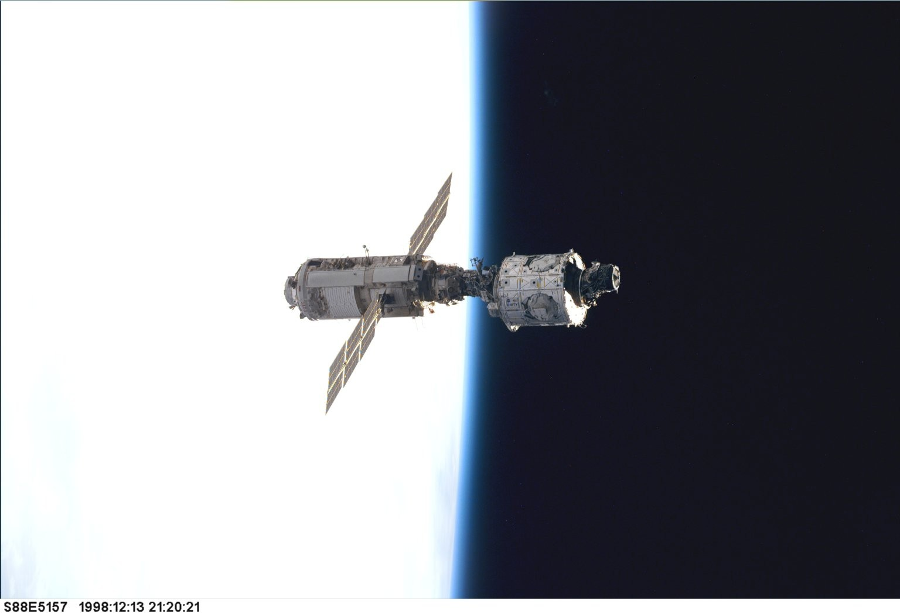

    

    <label class="ap-space-0" for="r-space-4" style="position:absolute;left:6px;top:50%;transform:translateY(-50%);width:32px;height:32px;background:rgba(13,17,23,0.75);border-radius:50%;align-items:center;justify-content:center;color:#c0caf5;font-size:18px;cursor:pointer;user-select:none;text-decoration:none;">&#9664;</label>
    <label class="ap-space-1" for="r-space-0" style="position:absolute;left:6px;top:50%;transform:translateY(-50%);width:32px;height:32px;background:rgba(13,17,23,0.75);border-radius:50%;align-items:center;justify-content:center;color:#c0caf5;font-size:18px;cursor:pointer;user-select:none;text-decoration:none;">&#9664;</label>
    <label class="ap-space-2" for="r-space-1" style="position:absolute;left:6px;top:50%;transform:translateY(-50%);width:32px;height:32px;background:rgba(13,17,23,0.75);border-radius:50%;align-items:center;justify-content:center;color:#c0caf5;font-size:18px;cursor:pointer;user-select:none;text-decoration:none;">&#9664;</label>
    <label class="ap-space-3" for="r-space-2" style="position:absolute;left:6px;top:50%;transform:translateY(-50%);width:32px;height:32px;background:rgba(13,17,23,0.75);border-radius:50%;align-items:center;justify-content:center;color:#c0caf5;font-size:18px;cursor:pointer;user-select:none;text-decoration:none;">&#9664;</label>
    <label class="ap-space-4" for="r-space-3" style="position:absolute;left:6px;top:50%;transform:translateY(-50%);width:32px;height:32px;background:rgba(13,17,23,0.75);border-radius:50%;align-items:center;justify-content:center;color:#c0caf5;font-size:18px;cursor:pointer;user-select:none;text-decoration:none;">&#9664;</label>
    <label class="an-space-0" for="r-space-1" style="position:absolute;right:6px;top:50%;transform:translateY(-50%);width:32px;height:32px;background:rgba(13,17,23,0.75);border-radius:50%;align-items:center;justify-content:center;color:#c0caf5;font-size:18px;cursor:pointer;user-select:none;text-decoration:none;">&#9654;</label>
    <label class="an-space-1" for="r-space-2" style="position:absolute;right:6px;top:50%;transform:translateY(-50%);width:32px;height:32px;background:rgba(13,17,23,0.75);border-radius:50%;align-items:center;justify-content:center;color:#c0caf5;font-size:18px;cursor:pointer;user-select:none;text-decoration:none;">&#9654;</label>
    <label class="an-space-2" for="r-space-3" style="position:absolute;right:6px;top:50%;transform:translateY(-50%);width:32px;height:32px;background:rgba(13,17,23,0.75);border-radius:50%;align-items:center;justify-content:center;color:#c0caf5;font-size:18px;cursor:pointer;user-select:none;text-decoration:none;">&#9654;</label>
    <label class="an-space-3" for="r-space-4" style="position:absolute;right:6px;top:50%;transform:translateY(-50%);width:32px;height:32px;background:rgba(13,17,23,0.75);border-radius:50%;align-items:center;justify-content:center;color:#c0caf5;font-size:18px;cursor:pointer;user-select:none;text-decoration:none;">&#9654;</label>
    <label class="an-space-4" for="r-space-0" style="position:absolute;right:6px;top:50%;transform:translateY(-50%);width:32px;height:32px;background:rgba(13,17,23,0.75);border-radius:50%;align-items:center;justify-content:center;color:#c0caf5;font-size:18px;cursor:pointer;user-select:none;text-decoration:none;">&#9654;</label>
    

      <label for="r-space-0" style="width:10px;height:10px;background:#7aa2f7;border-radius:50%;cursor:pointer;display:inline-block;"></label>
      <label for="r-space-1" style="width:10px;height:10px;background:#30363d;border-radius:50%;cursor:pointer;display:inline-block;"></label>
      <label for="r-space-2" style="width:10px;height:10px;background:#30363d;border-radius:50%;cursor:pointer;display:inline-block;"></label>
      <label for="r-space-3" style="width:10px;height:10px;background:#30363d;border-radius:50%;cursor:pointer;display:inline-block;"></label>
      <label for="r-space-4" style="width:10px;height:10px;background:#30363d;border-radius:50%;cursor:pointer;display:inline-block;"></label>
    

  

---

  <h2>Tokyonight</h2>
  

    
  

  

    <input class="r-tokyonight" type="radio" name="s-tokyonight" id="r-tokyonight-0" checked>
    <input class="r-tokyonight" type="radio" name="s-tokyonight" id="r-tokyonight-1">
    <input class="r-tokyonight" type="radio" name="s-tokyonight" id="r-tokyonight-2">
    <input class="r-tokyonight" type="radio" name="s-tokyonight" id="r-tokyonight-3">
    <input class="r-tokyonight" type="radio" name="s-tokyonight" id="r-tokyonight-4">
    

      
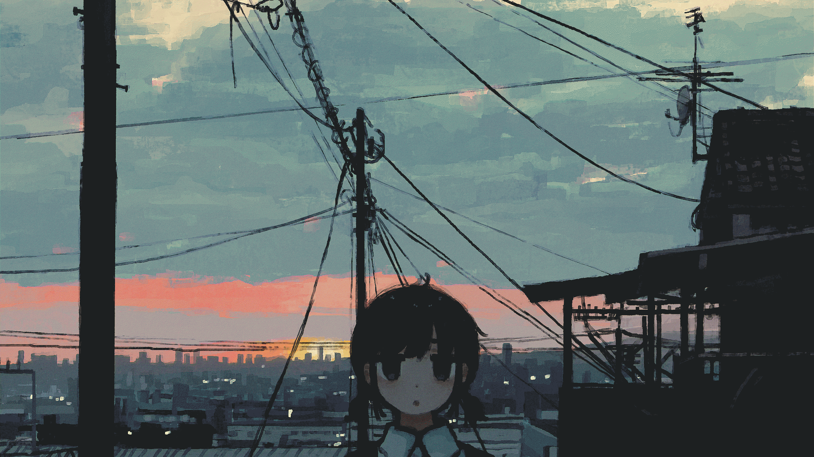

      
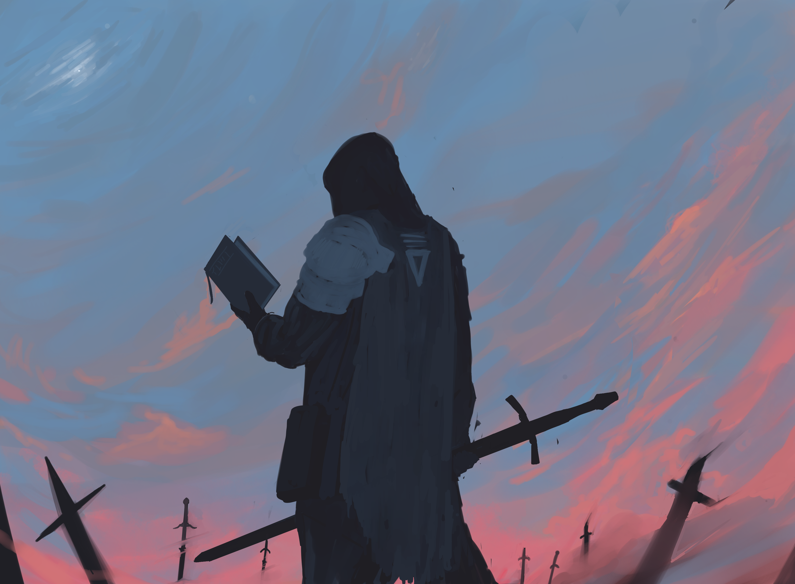

      

      
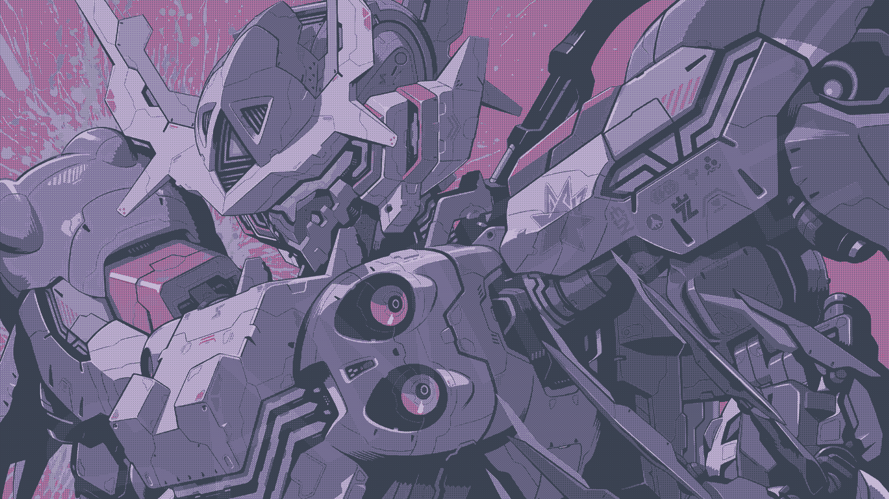

      

    

    <label class="ap-tokyonight-0" for="r-tokyonight-4" style="position:absolute;left:6px;top:50%;transform:translateY(-50%);width:32px;height:32px;background:rgba(13,17,23,0.75);border-radius:50%;align-items:center;justify-content:center;color:#c0caf5;font-size:18px;cursor:pointer;user-select:none;text-decoration:none;">&#9664;</label>
    <label class="ap-tokyonight-1" for="r-tokyonight-0" style="position:absolute;left:6px;top:50%;transform:translateY(-50%);width:32px;height:32px;background:rgba(13,17,23,0.75);border-radius:50%;align-items:center;justify-content:center;color:#c0caf5;font-size:18px;cursor:pointer;user-select:none;text-decoration:none;">&#9664;</label>
    <label class="ap-tokyonight-2" for="r-tokyonight-1" style="position:absolute;left:6px;top:50%;transform:translateY(-50%);width:32px;height:32px;background:rgba(13,17,23,0.75);border-radius:50%;align-items:center;justify-content:center;color:#c0caf5;font-size:18px;cursor:pointer;user-select:none;text-decoration:none;">&#9664;</label>
    <label class="ap-tokyonight-3" for="r-tokyonight-2" style="position:absolute;left:6px;top:50%;transform:translateY(-50%);width:32px;height:32px;background:rgba(13,17,23,0.75);border-radius:50%;align-items:center;justify-content:center;color:#c0caf5;font-size:18px;cursor:pointer;user-select:none;text-decoration:none;">&#9664;</label>
    <label class="ap-tokyonight-4" for="r-tokyonight-3" style="position:absolute;left:6px;top:50%;transform:translateY(-50%);width:32px;height:32px;background:rgba(13,17,23,0.75);border-radius:50%;align-items:center;justify-content:center;color:#c0caf5;font-size:18px;cursor:pointer;user-select:none;text-decoration:none;">&#9664;</label>
    <label class="an-tokyonight-0" for="r-tokyonight-1" style="position:absolute;right:6px;top:50%;transform:translateY(-50%);width:32px;height:32px;background:rgba(13,17,23,0.75);border-radius:50%;align-items:center;justify-content:center;color:#c0caf5;font-size:18px;cursor:pointer;user-select:none;text-decoration:none;">&#9654;</label>
    <label class="an-tokyonight-1" for="r-tokyonight-2" style="position:absolute;right:6px;top:50%;transform:translateY(-50%);width:32px;height:32px;background:rgba(13,17,23,0.75);border-radius:50%;align-items:center;justify-content:center;color:#c0caf5;font-size:18px;cursor:pointer;user-select:none;text-decoration:none;">&#9654;</label>
    <label class="an-tokyonight-2" for="r-tokyonight-3" style="position:absolute;right:6px;top:50%;transform:translateY(-50%);width:32px;height:32px;background:rgba(13,17,23,0.75);border-radius:50%;align-items:center;justify-content:center;color:#c0caf5;font-size:18px;cursor:pointer;user-select:none;text-decoration:none;">&#9654;</label>
    <label class="an-tokyonight-3" for="r-tokyonight-4" style="position:absolute;right:6px;top:50%;transform:translateY(-50%);width:32px;height:32px;background:rgba(13,17,23,0.75);border-radius:50%;align-items:center;justify-content:center;color:#c0caf5;font-size:18px;cursor:pointer;user-select:none;text-decoration:none;">&#9654;</label>
    <label class="an-tokyonight-4" for="r-tokyonight-0" style="position:absolute;right:6px;top:50%;transform:translateY(-50%);width:32px;height:32px;background:rgba(13,17,23,0.75);border-radius:50%;align-items:center;justify-content:center;color:#c0caf5;font-size:18px;cursor:pointer;user-select:none;text-decoration:none;">&#9654;</label>
    

      <label for="r-tokyonight-0" style="width:10px;height:10px;background:#7aa2f7;border-radius:50%;cursor:pointer;display:inline-block;"></label>
      <label for="r-tokyonight-1" style="width:10px;height:10px;background:#30363d;border-radius:50%;cursor:pointer;display:inline-block;"></label>
      <label for="r-tokyonight-2" style="width:10px;height:10px;background:#30363d;border-radius:50%;cursor:pointer;display:inline-block;"></label>
      <label for="r-tokyonight-3" style="width:10px;height:10px;background:#30363d;border-radius:50%;cursor:pointer;display:inline-block;"></label>
      <label for="r-tokyonight-4" style="width:10px;height:10px;background:#30363d;border-radius:50%;cursor:pointer;display:inline-block;"></label>
    

  

---

## File formats

The collection includes static and animated media:

| Format | Description |
|--------|-------------|
| JPG / JPEG | Photography and illustrations |
| PNG | Flat colors and transparent artwork |
| WEBP | High-performance images |
| GIF | Looping animated wallpapers |

## How to use

1. Open the category you like.
2. Pick the image you want.
3. Download it or copy its raw URL to use it as your desktop or phone wallpaper.

## Contributing

Suggestions and contributions are welcome. If you want to add a new wallpaper, place it in the right category and follow the existing naming style.

---

*This README was generated automatically. Do not edit it manually.*

